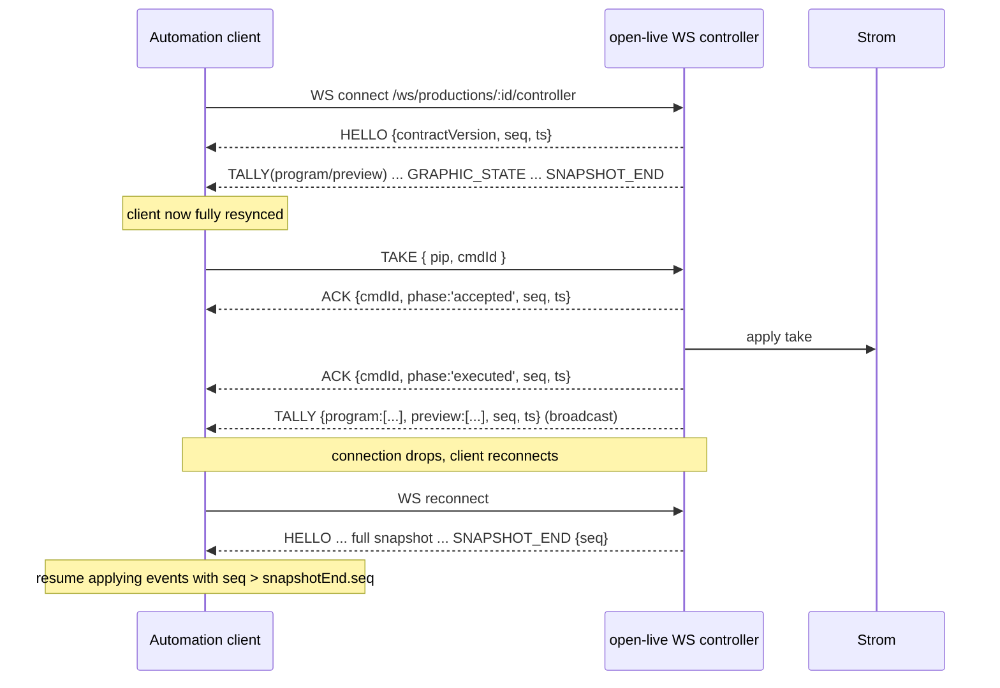

# Spec: Automation-ready control contract — drive Open Live from any automation system

**Status: Proposed** (architect draft for epic #209)
**Author:** architect agent
**Related issues:** #209 (epic); bundles #169 (event quality), #170 (documented contract),
#206 (clip transport); relates to #49, #56 (machine-client auth), #208 (guest calling)

> Proposed spec, not an accepted decision. This epic is an umbrella that ties existing issues
> and one new design change (contribution tally) into a single automation-readiness definition.
> The Open Questions require maintainer decisions before implementation sub-issues are cut.

## Problem Statement

Any production automation system (Sofie via a TSR device, Viz Mosart, Ross OverDrive, MOS-era
bridges, custom controllers) should be able to drive an Open Live production reliably as a
**control-plane client**: send commands, consume state events. All media stays in Open Live/Strom;
vendor adapters live outside this repo. The command vocabulary is already broad and largely
automation-sufficient; what is missing is a **documented, versioned, trustworthy contract** plus a
few correctness gaps.

Grounding in the current code (the surface already exists):
- WS controller `/ws/productions/:id/controller` (`src/ws/controller.ts:1513`) accepts a large
  discriminated-union command set validated by zod (`src/ws/controller.ts:84-208`): `CUT`,
  `TRANSITION` (40+ transition types, `TransitionTypeSchema` at `135`), `TAKE`, `SET_PVW`, `FTB`,
  `SET_OVL`, `GO_LIVE`, `CUT_STREAM`, `GRAPHIC_ON/OFF`, `DSK_TOGGLE`, `MACRO_EXEC`, a deep audio
  surface (`AUDIO_SET`, `AFV_SET`, `AFV_RAMP_SET`, `PFL_SET`, `AFL_SET`, `AUX_SEND_SET`,
  `AUX_MASTER_SET`, `GRP_SEND_SET`, `GRP_MASTER_SET`, `MONITOR_SET`, `SOURCE_OFFSET_SET`,
  `SOURCE_AUDIO_OFFSET_SET`, `LOUDNESS_RESET`), PiP (`SELECT_PVW_PIP`, `SET_PIP`) and
  `SET_EFFECT`.
- Outbound events use `broadcast(productionId, {...})` / `ws.send(...)`: `TALLY`, `PIP_STATE`,
  `DSK_STATE`, `OVL_STATE`, `FTB_STATE`, `ON_AIR`, `GRAPHIC`, `AUDIO_STATE`, `AFV_STATE`,
  `AFV_RAMP_STATE`, `MACRO_EXECUTED`, `MACRO_ERROR`, `ERROR`.
- Connect-time sync sends `TALLY`, `OVL_STATE`, `PIP_STATE`, `DSK_STATE`, then audio state
  (`src/ws/controller.ts:1560-1615`). Graphics-overlay active state is **not** in that snapshot.
- Tally is a single-slot `{ pgm: string|null, pvw: string|null }` (`src/db/types.ts:122-125`,
  `src/services/tally.service.ts`). While a PiP is on program the code broadcasts
  `PIP_STATE` with `pgmPip` set but `tally.pgm = null` (`src/ws/controller.ts:649,725`), so an
  automation cannot answer "is source X on air" when a PiP or keyed layer is involved.
- Events today carry no timestamp or sequence number, and there is no command-acknowledgment
  distinguishing "accepted" from "executed".

There is a human-readable `docs/controller-websocket.md` today, but no versioned, machine-oriented
contract with a compatibility policy.

## Scope (from #209)

1. Documented, versioned contract (WS + REST) with a compatibility policy — closes #170.
2. Clip transport (#206) — specified separately in `docs/specs/clip-story-playback.md`; this
   contract references its `CLIP_*` commands / `CLIP_STATE` event.
3. Event quality — closes #169: timestamps + monotonic sequence numbers on all state events;
   defined command-ack semantics (accepted vs executed).
4. Contribution-based tally — replace single-slot `{pgm,pvw}` with computed contribution sets.
5. Complete the connect-time snapshot — add graphics-overlay active state; document the full
   guaranteed snapshot.
6. A documented timing envelope — measured command-to-execution latency.

## Contract Design

### 1. Versioning + compatibility policy

- Publish the contract as a versioned document: `contractVersion` (semver, e.g. `1.0.0`) sent by
  the server in the first message on connect (a new `HELLO` event, below).
- Compatibility policy: additive changes (new command types, new optional event fields, new
  event types) are **minor**; removing/renaming a command or changing an existing field's meaning
  is **major**. Clients must ignore unknown event types and unknown fields (forward-compat rule
  stated in the contract).
- Optional client-declared version: clients MAY send `contractVersion` in a connect query param
  so the server can warn on a major mismatch. (Open Question 1: reject vs warn.)

### 2. Event quality (#169)

Every outbound state event gains two envelope fields, added uniformly at the `broadcast()` /
`ws.send()` layer (`src/services/tally.service.ts` `broadcast` + the controller):

```
{ type: '<EVENT>', seq: <monotonic int per production>, ts: '<ISO 8601 UTC>', ...payload }
```

- `seq` is a per-production monotonically increasing integer, allowing a reconnecting client to
  order events and detect gaps. It resets only on server restart (documented) — reconnect resync
  is via the connect snapshot (below), not seq replay.
- `ts` is the server-side event timestamp.

**Command acknowledgment** — introduce an optional client-supplied correlation id and a two-phase
ack, without breaking existing clients (fields are additive/optional):

```
client → { type: 'CUT', ..., cmdId?: '<client uuid>' }
server → { type: 'ACK', cmdId, phase: 'accepted', seq, ts }        # validated/queued
server → { type: 'ACK', cmdId, phase: 'executed', seq, ts }        # applied to Strom
server → { type: 'NACK', cmdId, error, seq, ts }                   # rejected
```

"accepted" = passed zod validation and was dispatched; "executed" = the corresponding Strom call
returned success (or the mixer mutation persisted). Existing `ERROR` events remain for connectionless
errors. Clients that do not send `cmdId` see today's behavior unchanged.

### 3. Contribution-based tally (#209 item 4)

Replace the single-slot model with a computed **contribution set** while keeping the legacy
`{pgm, pvw}` fields for backward compatibility (dual-emit during the current major version):

```
{
  type: 'TALLY',
  seq, ts,
  pgm: string | null,          // legacy, retained
  pvw: string | null,          // legacy, retained
  program: string[],           // NEW: all sources contributing to program
  preview: string[],           // NEW: all sources contributing to preview
  contributions?: [            // NEW: optional richer breakdown
    { source: string, role: 'main' | 'pip-bg' | 'pip-inset' | 'dsk' | 'graphic' }
  ]
}
```

The contribution set is computed from the mixer state the server already tracks: main PGM/PVW
plus `pgmPipByProduction` / `pvwPipByProduction` / `pipConfigsByProduction` (PiP background +
insets) and `dskLayersByProduction` (`src/ws/controller.ts`). This directly fixes the
"`tally.pgm` is null while a PiP is on program" gap (`src/ws/controller.ts:649,725`) so an
automation can answer "is source X contributing to program" in all mixer states.

### 4. Complete connect-time snapshot (#209 item 5)

Extend the connect sequence (`src/ws/controller.ts:1560-1615`) to emit, in a documented order,
a complete snapshot as a guaranteed part of the contract:

```
HELLO { contractVersion, productionId, seq, ts }
TALLY (with program/preview contribution sets)
PIP_STATE
DSK_STATE (per layer)
OVL_STATE
GRAPHIC_STATE (NEW: active graphics-overlay state — the currently missing piece)
AUDIO_STATE / AFV_STATE / AFV_RAMP_STATE (existing)
CLIP_STATE (per clip source, from #206)
GUEST_STATE (per guest, from #208, when guest calling enabled)
SNAPSHOT_END { seq }
```

`SNAPSHOT_END` lets a reconnecting client know the resync is complete and it may resume applying
live events with `seq > snapshotEnd.seq`.

### 5. REST surface + machine-client auth

- The contract document enumerates the automation-relevant REST endpoints already present
  (`/api/v1/productions`, `/api/v1/sources`, `/api/v1/outputs`, clip endpoints from #206, guest
  endpoints from #208) with their request/response/error codes.
- Machine-client auth reuses the existing `API_KEY` bearer gate (`src/config.ts`, `src/server.ts`)
  for both REST and the WS upgrade (WS already goes through the same auth path per the comment at
  `src/server.ts:154-164`). #49/#56 (finer-grained/rotatable machine tokens) are referenced as
  possible follow-ups — Open Question 3.

### 6. Timing envelope (#209 item 6)

Publish a measured command-to-execution latency under nominal load (p50/p95/p99 for `CUT`,
`TRANSITION`, `TAKE`, and a `CLIP_PLAY`), derived from the `accepted`→`executed` ACK interval.
This is a measurement task, not a code contract, but the contract documents the methodology and
the observed envelope so integrators know what scheduling accuracy to expect.

### Error / status codes

WS errors keep the existing `ERROR` event plus new `NACK` for correlated command rejection. REST
uses the existing convention: `400` invalid, `401` auth, `404` not found, `409` state conflict,
`502/503` upstream/DB unavailable.

## Data Model

Mostly additive and in-memory:
- No new persisted doc types required for the contract itself. The `seq` counter is per-production
  in-memory (documented to reset on restart); reconnect correctness relies on the snapshot, not
  persistence.
- The contribution tally is computed from existing in-memory registries; no schema change.
  Persisted `ProductionDoc.tally` may optionally be widened to store the contribution set for
  restart restoration (Open Question 2), but the legacy `{pgm,pvw}` field must remain.

### Migration

- All wire changes are additive within the current major contract version (new envelope fields
  `seq`/`ts`, new `HELLO`/`SNAPSHOT_END`/`ACK`/`NACK`/`GRAPHIC_STATE` events, new `program`/`preview`
  tally fields). Existing Studio/companion clients that ignore unknown fields/events keep working.
- `docs/controller-websocket.md` is superseded/expanded by the versioned contract document.

## Service Interactions



## Configuration (env vars)

No new env vars required for the contract itself; reuses `API_KEY` (`src/config.ts`). Optional:

| Env var | Default | Purpose |
|---------|---------|---------|
| `CONTRACT_STRICT_VERSION` | `false` | If true, reject WS clients declaring an incompatible major `contractVersion` instead of warning (Open Question 1) |

## Open Questions (need a human/maintainer decision)

1. **Version mismatch handling:** on a major-version mismatch declared by a client, reject the
   connection or accept-and-warn? (Governs `CONTRACT_STRICT_VERSION` default.)
2. **Tally persistence:** persist the contribution set on `ProductionDoc` for restart restoration,
   or recompute from live mixer state on next connect (current behavior for `{pgm,pvw}`)?
3. **Machine-client auth granularity:** is the single shared `API_KEY` sufficient for automation
   clients, or do we need per-client rotatable tokens (#49, #56) as part of this contract vs a
   follow-up epic?
4. **Armed / "execute at T" commands:** is a scheduled/armed-command semantic (execute at a
   timestamp) in scope for this contract, or explicitly out of scope for v1? #209 flags this as a
   spec question.
5. **ACK scope:** two-phase ACK on all commands, or only on the switching/clip commands where
   automations most need execution confirmation (to bound event volume)?
6. **Seq durability:** is a restart-resetting `seq` acceptable (relying on the snapshot for
   resync), or must `seq` survive restarts?

## Risks

- **Backward compatibility:** existing Studio and companion-module clients must tolerate the new
  envelope fields and events. The "ignore unknown fields/events" rule must be verified against the
  real Studio client before rollout, or the change becomes a breaking (major) one in practice.
- **Contribution-tally correctness is the hard part:** deriving accurate `program`/`preview` sets
  across CUT/TRANSITION/PiP/DSK/FTB transient states (there are already documented races around
  PiP appearing in both PGM and PVW — `src/ws/controller.ts:705`). This needs dedicated tests.
- **Event volume:** per-command two-phase ACK and higher-fidelity tally increase message volume;
  measure impact on the meter-relay / broadcast path.
- **Contract drift:** a published versioned contract must be kept in sync with the code. Tie the
  contract doc to CI (e.g. schema derived from the zod definitions) so it cannot silently drift —
  otherwise the "trustworthy" goal fails.
- **Depends on / enables #206 and #208:** clip and guest state are part of the snapshot; sequence
  those specs' state-event work with this contract to avoid publishing an incomplete v1.
