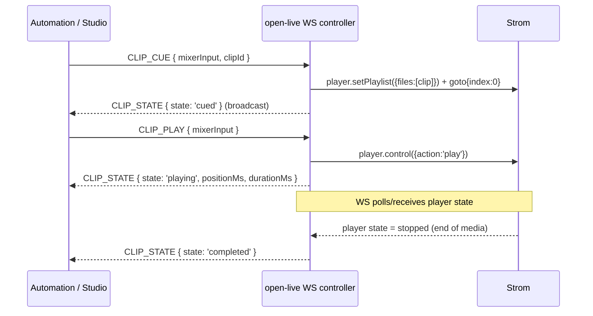

# Spec: Video clip ("story") playback — cue and play via API and WebSocket

**Status: Proposed** (architect draft for epic #206)
**Author:** architect agent
**Related issues:** #206 (epic), #209 (automation contract — consumes this)

> Proposed spec, not an accepted decision. Resolve the Open Questions with a maintainer
> before implementation sub-issues are cut.

## Problem Statement

Newsroom / rundown-driven workflows need a **cue-then-play** clip ("story") source: a clip is
preloaded and preview-ready ahead of time, then played on air at the exact moment the rundown
calls for it, with predictable low latency and no operator interaction. Open Live has no clip
source concept and no cue/play control today.

Grounding in the current code:
- Sources are `SourceDoc` with `streamType: 'srt' | 'efp' | 'whip' | 'test1' | 'test2' | 'html'`
  (`src/db/types.ts:28`). There is no clip/file source type.
- Sources are assigned to mixer inputs via `ProductionSourceAssignment { sourceId, mixerInput }`
  and `POST /api/v1/productions/:id/sources` (`src/db/types.ts:88-96`, `src/routes/productions.ts:644`).
- **Strom already has a media player block API** wrapped in the client
  (`src/lib/strom.ts:875-889`): `player.getState`, `player.control({action})`,
  `player.setPlaylist({files})`, `player.seek({position_ms})`, `player.goto({index})`.
  `PlayerAction = 'play' | 'pause' | 'stop' | 'next' | 'previous'` and
  `PlayerStateResponse = { state: 'playing'|'paused'|'stopped', current_file?, position_ms?, duration_ms?, playlist? }`
  (`src/lib/strom.ts:433-445`). This is the primitive cue/play maps onto — no new Strom
  capability is required.
- The WS controller (`/ws/productions/:id/controller`, `src/ws/controller.ts:1513`) is a
  discriminated-union command channel validated by zod (`src/ws/controller.ts:149-208`) with
  broadcast events (`TALLY`, `PIP_STATE`, `DSK_STATE`, `OVL_STATE`, `AUDIO_STATE`, `GRAPHIC`,
  `FTB_STATE`, `MACRO_EXECUTED`, `ERROR`) and a connect-time sync sequence
  (`src/ws/controller.ts:1541-1615`). New clip commands/events slot into these existing unions.

The epic touches the production/playout state machine and both control surfaces (REST + WS),
and later Studio and the companion module, so it needs a spec.

## API Design

### Clip source model

Add a clip source type. Two viable shapes (see Open Question 1):
- **(a)** extend `StreamType` with `'clip'` and treat it like any other source assigned to a
  mixer input, OR
- **(b)** a dedicated clip resource. This spec proposes **(a)** to reuse the existing
  source-assignment and tally machinery.

```
StreamType = 'srt' | 'efp' | 'whip' | 'test1' | 'test2' | 'html' | 'clip'
```

A `clip` `SourceDoc` uses `address` to carry the clip reference (URL/asset id) — matching how
existing types put their locator in `address` (`src/db/types.ts:33-43`). On activate, a clip
source resolves to a Strom media-player block; `open-live` persists its block id on the
production doc (see Data Model).

### REST — cue/play/stop/state

```
POST /api/v1/productions/:id/clips/:mixerInput/cue
  body: { clipId?: string }        # cue a specific clip into the ready state
  200 → ClipState
  404 → { error: 'Production not found' } | { error: 'Clip source not found' }
  409 → { error: 'Production is not activated' }

POST /api/v1/productions/:id/clips/:mixerInput/play
  body: { }                        # play the currently cued clip
  200 → ClipState

POST /api/v1/productions/:id/clips/:mixerInput/stop
  200 → ClipState

GET  /api/v1/productions/:id/clips/:mixerInput/state
  200 → ClipState
```

`ClipState` (mirrors Strom `PlayerStateResponse`, camelCased to match `open-live` API style):

```ts
interface ClipState {
  mixerInput: string;
  state: 'idle' | 'cued' | 'playing' | 'paused' | 'stopped' | 'completed' | 'error';
  clipId?: string;
  positionMs?: number;
  durationMs?: number;
  error?: string;
}
```

### WebSocket — commands and events

Add to the inbound discriminated union (`src/ws/controller.ts:84-111` and the zod schema at
`149-208`), reusing the `mixerInputSchema` already defined there:

```
| { type: 'CLIP_CUE';  mixerInput: string; clipId?: string }
| { type: 'CLIP_PLAY'; mixerInput: string }
| { type: 'CLIP_STOP'; mixerInput: string }
| { type: 'CLIP_PAUSE'; mixerInput: string }
| { type: 'CLIP_SEEK'; mixerInput: string; positionMs: number }
```

Add a broadcast event mirroring the existing `broadcast(productionId, { type: ... })` pattern:

```
{ type: 'CLIP_STATE', mixerInput, state, clipId?, positionMs?, durationMs?, error? }
```

`CLIP_STATE` is emitted on every transition (cued, playing, completed, error) and included in
the **connect-time sync** sequence for each clip source, alongside the existing `TALLY` /
`PIP_STATE` / `DSK_STATE` / `OVL_STATE` sync (`src/ws/controller.ts:1560-1613`) — this closes
part of #209's "complete the connect-time snapshot" requirement for clip state.

### State machine

```
idle --CUE--> cued --PLAY--> playing --(end of media)--> completed
 cued --CUE(other)--> cued
 playing --PAUSE--> paused --PLAY--> playing
 playing|paused --STOP--> stopped --CUE--> cued
 any --error--> error --CUE--> cued
```

`cue` = `player.setPlaylist({ files:[clip] })` + `player.goto({index:0})` and leave paused/ready;
`play` = `player.control({ action:'play' })`; `stop` = `player.control({ action:'stop' })`;
`pause` = `player.control({ action:'pause' })`; `seek` = `player.seek({ position_ms })`.

### Error codes

| Code | Condition |
|------|-----------|
| 400  | invalid body/param (zod) |
| 401  | missing/invalid `API_KEY` bearer (when configured) |
| 404  | production or clip source not found |
| 409  | production not activated / no clip cued on `play` |
| 502/503 | Strom unreachable (mirrors `stromErrorMessage` handling in controller) |

## Data Model

Reuse `SourceDoc` (add `'clip'` to `StreamType`). `ProductionDoc` gains an activate-set /
deactivate-cleared map from mixer input to Strom player block id, matching the existing
`sourceOffsetBlockIds` / `sourceAudioOffsetBlockIds` pattern (`src/db/types.ts:172-175`):

```ts
/** Maps mixerInput → media-player block ID for clip sources — set on activate, cleared on deactivate */
clipPlayerBlockIds?: Record<string, string>;
```

No persisted cue/play state on the doc for v1: like tally, live clip state is held in an
in-memory per-production registry in a small `clip-state` service (mirroring
`src/services/tally.service.ts`) and restored to Strom's actual player state on connect via
`player.getState`. (Open Question 3: whether cued clip should survive deactivate/reactivate.)

### Migration

- Adding `'clip'` to `StreamType` and the source-input zod enum is additive/backward compatible.
- The new `clipPlayerBlockIds` field is optional; existing docs are unaffected. CouchDB is
  schemaless — no data migration. OpenAPI (`docs/openapi.yaml`) and the WS reference
  (`docs/controller-websocket.md`) must be updated in lockstep.

## Service Interactions



## Configuration (env vars)

No new env vars strictly required — clip playback reuses the existing `STROM_URL` /
`STROM_AUTH_MODE` client config (`src/config.ts`). Optional:

| Env var | Default | Purpose |
|---------|---------|---------|
| `CLIP_STATE_POLL_MS` | `250` | Interval at which the WS layer polls `player.getState` to detect completion (if Strom does not push player state changes — see Open Question 2) |

## Open Questions (need a human/maintainer decision)

1. **Clip source shape:** extend `StreamType` with `'clip'` (proposed) vs a dedicated clip
   resource decoupled from the sources catalogue. Affects Studio and the automation contract (#209).
2. **Completion signalling:** does Strom push player state transitions (so `open-live` can emit
   `CLIP_STATE completed` reactively), or must `open-live` poll `player.getState`? If polling,
   the timing accuracy of `completed` is bounded by `CLIP_STATE_POLL_MS` — #209 asks for a
   documented timing envelope, so this must be measured.
3. **Cue persistence:** should a cued clip survive deactivate/reactivate and server restart
   (like PiP layout and tally do), or reset to `idle`?
4. **Cue semantics vs on-air:** "cued/preview-ready" — does cueing route the clip to the
   preview bus (so it shows in the multiviewer before play), or is cue purely a preload with the
   operator using the normal `SET_PVW`/`TAKE` switching to put it on air? This determines how
   clip cue/play interacts with the existing tally/switching model.
5. **Clip ingest/storage:** #206 assumes a playable clip reference already exists. Confirm the
   accepted `address` forms (HTTP(S) URL, MinIO/S3 object from #5, asset id) and whether any
   validation like `src/lib/url-validation.ts` applies.

## Risks

- **Timing predictability:** rundown automation demands low-latency, predictable play. If
  completion is poll-based, jitter up to the poll interval is exposed to integrators; document it.
- **Preview-bus interaction:** conflating cue with preview could fight the existing PGM/PVW tally
  model (which #209 already flags as under-modelled for PiP). Keep clip state orthogonal to
  vision-mixer tally unless Open Question 4 says otherwise.
- **Player-block availability:** assumes the media-player block is present in the running flow.
  If the flow-generator does not emit a player block for `clip` sources, cue/play will 409/502
  until the generator is extended (implementation task, not an external dependency).
- **Contract stability:** #209 will publish this WS vocabulary as part of a versioned contract;
  name the commands/events deliberately now to avoid a breaking rename later.
