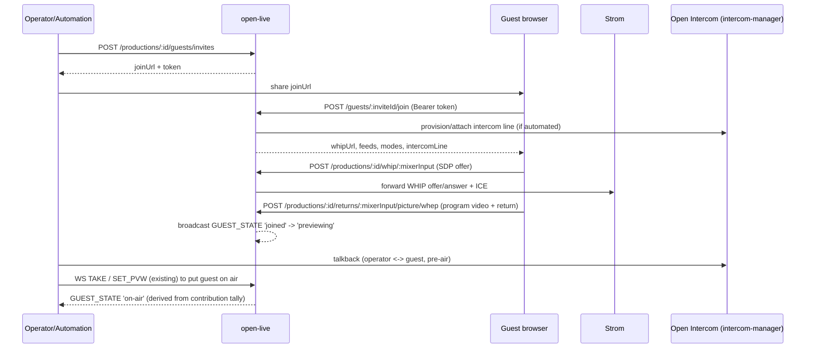

# Spec: Integrated guest calling — browser guest join (WHIP/WHEP) + Open Intercom talkback

**Status: Accepted** (architect draft for epic #208; blocking topology/return/picture-source
questions resolved by @svensson00 on #208, 2026-09-16 —
https://github.com/Eyevinn/open-live/issues/208#issuecomment-5696583364)
**Author:** architect agent
**Related issues:** #208 (epic); relates to #206 (clip), #209 (automation contract),
Eyevinn/intercom-manager (Open Intercom)

> **Accepted.** The three blocking product/topology calls (OQ1 guest-video topology, OQ2 return
> feed, OQ7 guest picture source) were decided by the PM decision authority @svensson00 on the
> #208 epic thread (2026-09-16); their resolutions are recorded inline below. The remaining Open
> Questions (OQ2-low-latency-mix / OQ3 / OQ4 / OQ5 / OQ6, renumbered/clarified below) are
> implementation-detail or dependent-ticket calls that do not block accepting this spec or
> breaking the epic into sub-issues.

## Problem Statement

Open Live supports WHIP sources and REMI-style remote production but has no managed remote-guest
workflow: no join link, no green room / pre-air preview, no return feed to the guest, and no
operator↔guest talkback. Newsroom and emergency-broadcast workflows require an operator to
preview and talk to a remote contributor before taking them on air. Eyevinn already ships the
talkback half as a product — **Open Intercom** (`Eyevinn/intercom-manager` + `intercom-frontend`),
a WebRTC/Symphony-Media-Bridge intercom with a line/session model exposing WHIP/WHEP — so this
epic is primarily an **integration** between Open Live and Open Intercom, not a new comms stack.

Grounding in the current code:
- WHIP ingest is already proxied per production+input:
  `POST/PATCH/DELETE /api/v1/productions/:id/whip/:mixerInput` forwards SDP offer/answer, ICE
  trickle and teardown to Strom (`src/routes/whip.ts:35-167`). The Strom WHIP endpoint is derived
  as `${STROM_URL}/whip/whip-<padIndex>-<suffix>` (`src/routes/whip.ts:49-55`).
- WHEP egress/return is proxied via `POST/DELETE /api/v1/whep-proxy?target=<encoded>`
  (`src/routes/whep-proxy.ts:28-124`), and productions already publish `whepEndpoint`,
  `pgmWhepEndpoint`, and per-output `whepOutputUrls` (`src/db/types.ts:153-160`).
- Sources carry `streamType: 'whip'` and are assigned to mixer inputs via
  `ProductionSourceAssignment` (`src/db/types.ts:28,88-96`). A guest maps naturally onto a
  WHIP source assignment, so the guest-video path can reuse the existing WHIP source machinery
  without depending on unmerged intercom video work.
- The WS controller already broadcasts source/mixer state and syncs on connect
  (`src/ws/controller.ts:1541-1615`); guest lifecycle events slot into that event model.

The epic touches `open-live` (API/WS + source lifecycle), `open-live-studio` (guest UI), Strom
(return/mix-minus path), and the Open Intercom family (line provisioning + the SVT video merge
question), so it needs a spec.

## Design principle: WHIP-video + intercom-audio fallback is first-class

Per #208, video support for Open Intercom exists at SVT but may not be merged upstream. The epic
**must not hard-depend on unmerged work.** This spec's baseline topology is:

- **Guest video/audio contribution → Open Live via the existing WHIP source path** (already built).
- **Guest return feed → WHEP**, program mix-minus by default, via a per-guest return route
  (see [Return feed design](#return-feed-design)).
- **Operator↔guest talkback → Open Intercom**, carrying audio talkback (video-over-intercom is an
  optional enhancement gated on the SVT merge — Open Question 1).

## Return feed design

A guest's return feed is on-air program audio: what the audience hears, minus the guest. Open
Intercom stays off-air talkback. On-air conversation between guests rides the return feed, not
intercom.

| Mode | Contents | Timing |
|------|----------|--------|
| `program` | program mix | synced to picture |
| `program-minus` | program mix without the guest's own channel | synced to picture |
| `low-latency-minus` | same as `program-minus`, on a separate fast feed | ahead of picture (after v1) |

**Mix-minus at launch.** `program-minus` is the default; `program` is a live per-guest switch for
guests who only listen.

### Synced modes (v1)

- **One post-fader aux bus per guest** on the existing `builtin.mixer`, with a send from every
  audio channel. `program-minus` closes the guest's own send; `program` opens it. Send levels
  (`ch{N}_aux{M}_level`) are live, so the mode can change mid-show, and post-fader sends follow
  the crew's faders and mutes.
- **Mirror `to_main` into return sends.** Mute and audio-follow-video set `ch{N}_to_main`
  (`src/ws/controller.ts:1168,1206`), and Strom takes aux sends before that routing. Every
  `to_main` change must be copied into each return's sends in the same Strom update, or a
  return keeps channels the crew has taken off program.
- **Channel mix, not processed program.** Aux buses skip the main-bus compressor, EQ and
  limiter. Acceptable for a guest's ears.
- **Return buses are numbered after the crew's aux buses** and excluded from the loops that
  wire every aux bus into every WHEP output (`src/lib/flow-generator.ts:283-299,751-768`); those
  outputs are capped at 8 audio tracks and send every track to every viewer.
- **One picture feed per guest:** a `builtin.whep_output` with program video and exactly one
  audio track, that guest's return. A mode change is one send level.
- **Fixed at build time.** Aux bus count and WHEP endpoints cannot change on a running flow, so a
  guest joining an active production needs a spare return (Open Question 5).

**Picture source** (OQ7 — RESOLVED by @svensson00, #208 2026-09-16: v1 guests see **program
output via WHEP**; per-guest return video is a later enhancement):

| Source | Cost | Adapts to the guest's link |
|--------|------|----------------------------|
| (i) PGM encoder output, passed through | none | no — program bitrate (default 10 Mbps); join time follows program's keyframe interval (60 frames by default) |
| (ii) raw program video, encoded per guest | one encode per guest | yes, where the encoder supports bitrate control (not macOS VideoToolbox) |
| (iii) one shared low-bitrate program encode | one encode | no, but bounded low, with a GOP chosen for fast joins |

**Decision (OQ7):** v1 ships program output over WHEP — option (iii), a single shared low-bitrate
program encode, is the recommended realisation of "program output via WHEP" (falling back to (i)
where a dedicated shared encode isn't warranted). Per-guest encoded return video (option (ii)) is
explicitly a later enhancement.

### Low-latency mode (after v1)

`low-latency-minus` is for on-air conversation between guests: the minus mix on its own
audio-only WHEP output, played by the client in place of the picture feed's audio. v1 accepts
only `returnFeed.lowLatency: false`. Before it ships:

- **Absorb stalls after the jitterbuffer, not in it.** Each seat keeps one WHIP jitterbuffer
  at its quality setting (Strom's default is 400 ms), shared by program and the fast feed.
  Shortening it does not help: publishers do not retransmit Opus, a 400–700 ms network
  stall passes through the jitterbuffer at any practical setting, and a shorter one only drops
  audio that arrives late. Program dropout at an audio jitterbuffer of 100 ms against 400 ms
  was 4.9% against 0.2% with 150 ms link stalls, and 10.6% against 0.14% with 300 ms stalls
  (Strom loopback rig, fixed stalls every 3 s on the WHIP publishers' packets, dropout of a
  test tone on the program WHEP output, 3 trials per cell). The fast feed instead needs stalls
  absorbed downstream of the jitterbuffer, on the conversation path only: run at a low target
  latency, time-stretch audio to cover a stall rather than go silent, then play slightly fast
  until back at target. A prototype recovered a 400 ms stall with no skip and no added
  dropout; nothing that does this is built yet.
- **Conversation audio never airs.** What airs is each voice via the program path, buffered and
  unstretched; the conversation path governs only what guests hear of each other. It must
  never feed program output or a recording, because time-scaled audio cannot be recovered
  afterwards.
- **Path headroom.** A return that bypasses the audio mixer (`mix_latency`, with
  `min_upstream_latency` set to the slowest SRT source, `src/lib/flow-generator.ts:148-153,418-435`)
  may be released early with a negative WHEP `ts_offset_ms`. Unverified on Open Live's flow; must
  be measured.
- **Which mix feeds it** — see the "Mix for the low-latency return (after v1)" remaining open
  question below (an implementation-time call, not a v1 blocker).

## API Design

New routes under the existing `/api/v1` prefix, same conventions (zod validation, `toApi` id
mapping, `503` on DB failure, `API_KEY` bearer gate).

### Guest invites (production-scoped)

```
POST   /api/v1/productions/:id/guests/invites
  body: { label?: string, expiresInS?: number }
  201 → { id, productionId, joinUrl, token, expiresAt, mixerInput }
  404 → { error: 'Production not found' }

GET    /api/v1/productions/:id/guests/invites
  200 → [ GuestInvite, ... ]

DELETE /api/v1/productions/:id/guests/invites/:inviteId
  204
```

### Guest join (called by the guest browser via the invite link, token-authed)

```
POST   /api/v1/guests/:inviteId/join       (Authorization: Bearer <invite token>)
  200 → { guestId, whipUrl, feeds, modes, defaultMode, returnMode, intercomLine? }
      # whipUrl → existing /api/v1/productions/:id/whip/:mixerInput contract
      # feeds[].url → per-guest /api/v1/productions/:id/returns/:mixerInput/... routes, not
      #   /api/v1/whep-proxy?target=..., which forwards to any URL on the Strom host and so
      #   cannot be scoped to one guest's token
      # modes, defaultMode, returnMode → the guest's return modes (see Return feed)
  401 → { error: 'Invalid or expired invite' }

DELETE /api/v1/guests/:inviteId/session    (guest leaves)
  204
```

### Guest management (operator / automation)

```
GET    /api/v1/productions/:id/guests
  200 → [ GuestSession, ... ]

DELETE /api/v1/productions/:id/guests/:guestId       # kick
  204
```

Guest take-to-air / preview reuses the **existing** vision-mixer surface (a guest is a WHIP
source assigned to a mixer input, so `SET_PVW` / `TAKE` in the WS controller already put it on
preview/program). No new switching commands are introduced.

### Return feeds (per mixer input)

Return URLs are issued by the server; clients never build them. Design in
[Return feed design](#return-feed-design).

```
POST/DELETE /api/v1/productions/:id/returns/:mixerInput/picture/whep
POST/DELETE /api/v1/productions/:id/returns/:mixerInput/fast/whep   # lowLatency only (after v1)
PUT         /api/v1/productions/:id/returns/:mixerInput/mode        # crew; body { mode }
GET         /api/v1/productions/:id/returns/:mixerInput             # crew; join shape, no guest fields
PUT         /api/v1/guests/:inviteId/session/return                 # guest token; body { mode }
```

Return fields in the join response:

```ts
feeds: { id: 'picture' | 'fast'; url: string; video: boolean }[];
modes: {
  key: 'program' | 'program-minus' | 'low-latency-minus';
  label: string;
  synced: boolean;
  excludesMixerInput?: string;   // on every minus mode
  delivery: { kind: 'picture-switch' } | { kind: 'feed'; feed: 'fast' };
}[];
defaultMode: string;             // 'program-minus'
returnMode: 'program' | 'program-minus';   // current mode of the picture feed's track
```

- **`excludesMixerInput`** — the client asserts it equals its own publish input, so a wrong
  return is an error rather than a guest hearing themselves.
- **Mode changes** — `PUT …/mode`, the guest route and `RETURN_SET` share one handler: persist,
  apply live if active, broadcast `RETURN_STATE`. Only `program` and `program-minus`;
  `low-latency-minus` is a client-side feed choice and returns `400`.
- **Scoping** — the Strom target is derived server-side, as the WHIP proxy does
  (`src/routes/whip.ts:30-35`), and session URLs are checked against that output's endpoint path,
  not just the Strom origin. Credentials in `Authorization` only. A guest token is scoped to its
  `mixerInput`. (`/whep-proxy?target=` forwards to any Strom URL, so it cannot be guest-scoped.)
- **Errors** — `production_inactive` (409); `feed_unavailable` (404 no return on the input, 503
  Strom unreachable).
- **Crew `GET`** — for contributor pages before invites land; a link using it carries crew-level
  access. Inactive production → `200` with empty `publish` and `feeds`; no return on the input →
  `200` with `publish` only; `404` only for a missing production or assignment. `publish` covers
  catalogue `whip` sources too, not only the virtual `Whip` source
  (`src/routes/productions.ts:296`).

### WebSocket — guest lifecycle and return events

Add a broadcast event to the controller's event model (same `broadcast(productionId, {...})`
pattern), and include the current guest set in the connect-time sync (extending the snapshot
that #209 wants to complete):

```
{ type: 'GUEST_STATE', guestId, mixerInput, state, label?, intercomLine? }
  state ∈ 'invited' | 'joined' | 'previewing' | 'on-air' | 'left' | 'error'
```

`previewing` / `on-air` are **derived** from the vision mixer's PVW/PGM contribution for the
guest's mixer input (this is exactly the contribution-tally gap #209 raises — accurate
`on-air` for a guest depends on #209's contribution-set tally model, especially when the guest
is a PiP inset).

Crew switch a guest's synced return with a command; the resulting state is broadcast and
included in the connect-time sync:

```
{ type: 'RETURN_SET', mixerInput, mode }      # command
{ type: 'RETURN_STATE', mixerInput, mode }    # broadcast
  mode ∈ 'program' | 'program-minus'
```

### Error codes

| Code | Condition |
|------|-----------|
| 400  | invalid body (zod) |
| 401  | missing/invalid invite token or `API_KEY` |
| 403  | invite for a different production |
| 404  | production / invite / guest not found; no return on that input |
| 409  | invite expired / capacity reached; production inactive (return feeds) |
| 502/503 | Strom or intercom-manager unreachable |

## Data Model

New CouchDB doc types (own DBs, mirroring `getSourcesDb()`/`getOutputsDb()` in `src/db/index.ts`):

```ts
interface GuestInviteDoc {
  _id: string;              // "guest-invite-<uuid>"
  _rev?: string;
  type: 'guest-invite';
  productionId: string;
  tokenHash: string;        // store a hash, never the raw token
  label?: string;
  mixerInput?: string;      // input the guest will occupy (allocated on join if absent)
  expiresAt: string;        // ISO 8601
  createdAt: string;
  updatedAt: string;
}

interface GuestSessionDoc {
  _id: string;              // "guest-session-<uuid>"
  _rev?: string;
  type: 'guest-session';
  productionId: string;
  inviteId: string;
  mixerInput: string;
  state: 'joined' | 'previewing' | 'on-air' | 'left' | 'error';
  intercomLineId?: string;  // reference into intercom-manager, when provisioned
  whipSessionId?: string;
  createdAt: string;
  updatedAt: string;
}
```

`ProductionDoc` optionally records the associated intercom resource so talkback lines can be
provisioned/torn down with the production lifecycle:

```ts
/** Open Intercom production/line grouping id — set when guest calling is enabled */
intercomProductionId?: string;
```

`ProductionSourceAssignment` gains an optional return:

```ts
interface ProductionSourceAssignment {
  sourceId: string;
  mixerInput: string;
  returnFeed?: { synced: 'program' | 'program-minus'; lowLatency?: boolean }; // v1: lowLatency false
}
```

The return belongs to the assignment, not the guest session, so a rejoin on the same `mixerInput`
keeps it and crew-added contributors can have one. `lowLatency` decides at activation whether a
fast feed is built.

### Migration

- All additive: new doc types, optional `ProductionDoc.intercomProductionId` and optional
  `ProductionSourceAssignment.returnFeed`. CouchDB is schemaless; no data migration. New DBs
  created on boot in `src/db/index.ts`.
- OpenAPI (`docs/openapi.yaml`) and WS reference (`docs/controller-websocket.md`) updated in lockstep.

## Service Interactions



## Configuration (env vars)

Reuses existing `STROM_URL`, `PUBLIC_BASE_URL` (for building `joinUrl`/WHIP callback URLs,
`src/config.ts`), and the WHIP/WHEP proxy config. New:

| Env var | Required | Default | Purpose |
|---------|----------|---------|---------|
| `INTERCOM_MANAGER_URL` | to enable talkback | — | Base URL of the Open Intercom manager |
| `INTERCOM_MANAGER_TOKEN` | to enable talkback | — | Auth token (redact in `src/lib/log-redact.ts`) |
| `GUEST_INVITE_TTL_S` | no | `86400` | Default invite lifetime |
| `GUEST_INVITE_SECRET` | yes (to enable guests) | — | HMAC secret for signing invite tokens |

When intercom vars are unset, guest calling still works with WHIP video + WHEP return but no
talkback line (feature degrades cleanly — the fallback is first-class by design).

## Open Questions

### Resolved by @svensson00 (#208, 2026-09-16)

These three blocking calls were decided by the PM decision authority on the epic thread
(https://github.com/Eyevinn/open-live/issues/208#issuecomment-5696583364), unblocking this spec
from Proposed → Accepted.

1. **OQ1 — Guest-video topology (the core decision): RESOLVED — WHIP-video + audio-only talkback.**
   Guest video goes through **Open Live's own WHIP-in path**; Open Intercom carries **talkback
   audio only**. @svensson00: "Production media belongs in Open Live per the reference
   architecture, and I don't want this epic gated on intercom-side video upstreaming." This matches
   the spec's baseline topology (see [Design principle](#design-principle-whip-video--intercom-audio-fallback-is-first-class));
   video-over-intercom is not a v1 dependency and the SVT-merge risk below is now closed.
2. **OQ2 — Return feed: RESOLVED — per-guest mix-minus.** The default return is **`program-minus`**
   (per-guest mix-minus), not program-with-delay. @svensson00: "Program-with-delay returns the
   guest's own voice delayed and is unusable in conversation; `builtin.audiorouter`'s routing matrix
   should make N-1 feasible." This is exactly what the [Return feed design](#return-feed-design)
   already specifies (one post-fader aux bus per guest, `program-minus` default).
7. **OQ7 — Guest picture source: RESOLVED — program output via WHEP for v1.** v1 guests see
   **program output via WHEP**; per-guest return video is a later enhancement. This confirms the
   spec's proposed shared/program-based picture feed for v1 (see
   [Return feed design](#return-feed-design), picture-source option (iii)/(i)); per-guest encode is
   deferred.

### Remaining (implementation-detail / dependent-ticket — do not block acceptance)

These do not gate accepting the spec or cutting sub-issues; they are resolved during
implementation or in a dependent `open-live-studio` ticket.

- **Mix for the low-latency return (after v1):** `builtin.liveaudiorouter` fed before the mixer.
  Not an aux bus on `builtin.mixer`: it puts the conversation through the program
  mixer, which passes one guest's bad link on to every other guest. With one contributor on a
  badly impaired link, the other contributors' audio on the `liveaudiorouter` path kept 0.13–0.18%
  dropout, the same as the control, while the program mixer took every contributor's audio to 7%
  dropout and shifted its own delay by 220 ms (Strom loopback rig, 0–200 ms jitter, 0.4–1.2 s
  stalls and about 13% burst loss on one WHIP publisher's packets, dropout of a test tone from a
  clean contributor). Open: the router feeds raw microphones, with no limiter unless
  Eyevinn/strom#795 lands. Measure path headroom first; see
  [Low-latency mode](#low-latency-mode-after-v1). Only relevant once `low-latency-minus` ships;
  v1 is `lowLatency: false`.
- **Guest auth model for invite links:** production-scoped, expiring, single-use vs reusable? This
  spec proposes signed (HMAC) expiring tokens stored as hashes — adopted as the implementation
  default.
- **Intercom line provisioning:** automated per production via the intercom-manager API (this
  spec's `intercomProductionId` assumes this is feasible) vs manually configured in v1. Requires
  confirming intercom-manager's line/session API shape during implementation.
- **Capacity / limits:** max simultaneous guests per production and its effect on Strom flow
  sizing and mixer input allocation — an implementation-time sizing call.
- **Where does the green-room preview live** — Studio multiviewer only, or a dedicated preview
  surface? Studio UI scope; defers to a dependent `open-live-studio` ticket.

## Risks

- **Dependency on unmerged SVT intercom-video work** — **closed by OQ1** (@svensson00, #208
  2026-09-16): guest video goes through Open Live's own WHIP-in path and Open Intercom carries
  talkback audio only, so the epic no longer touches intercom-side video and cannot block on that
  merge. Video-over-intercom is out of scope for this epic.
- **Accurate on-air state for guests** depends on #209's contribution-tally model; without it,
  a guest shown as a PiP inset would report `tally.pgm = null` and the `on-air` derivation would
  be wrong. Sequence #209 (or its tally sub-work) before the `on-air` guest state is trusted.
- **Cross-product coupling:** open-live now depends operationally on a reachable intercom-manager;
  the degrade-to-no-talkback path must be tested, not just designed.
- **Invite token leakage:** tokens grant WHIP publish into a live production; short TTL, hashed
  storage, and per-invite revocation (DELETE) are mandatory. Redact `INTERCOM_MANAGER_TOKEN` and
  `GUEST_INVITE_SECRET` in logs.
- **Wrong channel → guest hears themselves:** the flow generator gives test sources an audio
  channel (`src/lib/flow-generator.ts:388-392,476`) but the controller and `GET /audio` skip them
  (`src/ws/controller.ts:588,637`, `src/routes/audio.ts:79`). With a test source on a lower
  input, mute/AFV act on the wrong strip and a return would close the wrong send. Fix before
  building returns.
- **Guest token reach:** that guest's WHIP input, return routes and `GET /ice-servers` — never
  `/whep-proxy?target=`. WHIP PATCH/DELETE accept any `session=` URL on the Strom host
  (`src/routes/whip.ts:9-11`), so sessions must be tied to their endpoint or one guest can tear
  down another's. Strom's `/whip/` and `/whep/` are unauthenticated and endpoint IDs are listed
  publicly, so this only holds where Strom's HTTP API is unreachable or gated — unconfirmed for
  OSC.
- **Scope size:** this epic almost certainly needs to be broken into sub-issues (invites+join,
  return/mix-minus, intercom provisioning, guest WS events, Studio UI) after the topology
  decision (Open Question 1) is made.
