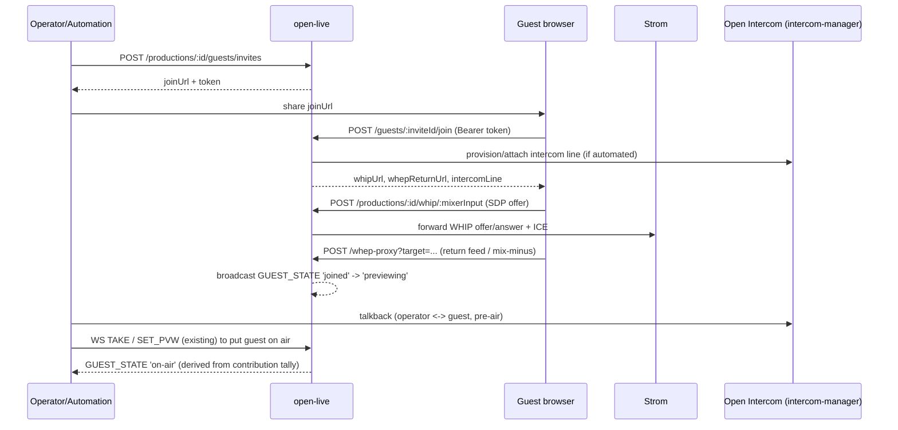

# Spec: Integrated guest calling — browser guest join (WHIP/WHEP) + Open Intercom talkback

**Status: Proposed** (architect draft for epic #208)
**Author:** architect agent
**Related issues:** #208 (epic); relates to #206 (clip), #209 (automation contract),
Eyevinn/intercom-manager (Open Intercom)

> Proposed spec, not an accepted decision. This is a very large, cross-product epic. Several
> Open Questions below are genuine product/topology decisions that a maintainer must make — this
> spec deliberately does not invent answers to them.

## Problem Statement

Open Live supports WHIP sources and REMI-style remote production but has no managed remote-guest
workflow: no join link, no green room / pre-air preview, no return feed to the guest, and no
operator↔guest talkback. Newsroom and emergency-broadcast workflows require an operator to
preview and talk to a remote contributor before taking them on air. Eyevinn already ships the
talkback half as a product — **Open Intercom** (`Eyevinn/intercom-manager` + `intercom-frontend`),
a WebRTC/Symphony-Media-Bridge intercom with a line/session model exposing WHIP/WHEP — so this
epic is primarily an **integration** between Open Live and Open Intercom, not a new comms stack.

Grounding in the current code:
- WHIP ingest is already proxied per production+input:
  `POST/PATCH/DELETE /api/v1/productions/:id/whip/:mixerInput` forwards SDP offer/answer, ICE
  trickle and teardown to Strom (`src/routes/whip.ts:35-167`). The Strom WHIP endpoint is derived
  as `${STROM_URL}/whip/whip-<padIndex>-<suffix>` (`src/routes/whip.ts:49-55`).
- WHEP egress/return is proxied via `POST/DELETE /api/v1/whep-proxy?target=<encoded>`
  (`src/routes/whep-proxy.ts:28-124`), and productions already publish `whepEndpoint`,
  `pgmWhepEndpoint`, and per-output `whepOutputUrls` (`src/db/types.ts:153-160`).
- Sources carry `streamType: 'whip'` and are assigned to mixer inputs via
  `ProductionSourceAssignment` (`src/db/types.ts:28,88-96`). A guest maps naturally onto a
  WHIP source assignment, so the guest-video path can reuse the existing WHIP source machinery
  without depending on unmerged intercom video work.
- The WS controller already broadcasts source/mixer state and syncs on connect
  (`src/ws/controller.ts:1541-1615`); guest lifecycle events slot into that event model.

The epic touches `open-live` (API/WS + source lifecycle), `open-live-studio` (guest UI), Strom
(return/mix-minus path), and the Open Intercom family (line provisioning + the SVT video merge
question), so it needs a spec.

## Design principle: WHIP-video + intercom-audio fallback is first-class

Per #208, video support for Open Intercom exists at SVT but may not be merged upstream. The epic
**must not hard-depend on unmerged work.** This spec's baseline topology is:

- **Guest video/audio contribution → Open Live via the existing WHIP source path** (already built).
- **Guest return feed → WHEP** (program or mix-minus) via the existing WHEP proxy.
- **Operator↔guest talkback → Open Intercom**, carrying audio talkback (video-over-intercom is an
  optional enhancement gated on the SVT merge — Open Question 1).

## API Design

New routes under the existing `/api/v1` prefix, same conventions (zod validation, `toApi` id
mapping, `503` on DB failure, `API_KEY` bearer gate).

### Guest invites (production-scoped)

```
POST   /api/v1/productions/:id/guests/invites
  body: { label?: string, expiresInS?: number }
  201 → { id, productionId, joinUrl, token, expiresAt, mixerInput }
  404 → { error: 'Production not found' }

GET    /api/v1/productions/:id/guests/invites
  200 → [ GuestInvite, ... ]

DELETE /api/v1/productions/:id/guests/invites/:inviteId
  204
```

### Guest join (called by the guest browser via the invite link, token-authed)

```
POST   /api/v1/guests/:inviteId/join       (Authorization: Bearer <invite token>)
  200 → { guestId, whipUrl, whepReturnUrl, intercomLine? }
      # whipUrl → existing /api/v1/productions/:id/whip/:mixerInput contract
      # whepReturnUrl → existing /api/v1/whep-proxy?target=... contract
  401 → { error: 'Invalid or expired invite' }

DELETE /api/v1/guests/:inviteId/session    (guest leaves)
  204
```

### Guest management (operator / automation)

```
GET    /api/v1/productions/:id/guests
  200 → [ GuestSession, ... ]

DELETE /api/v1/productions/:id/guests/:guestId       # kick
  204
```

Guest take-to-air / preview reuses the **existing** vision-mixer surface (a guest is a WHIP
source assigned to a mixer input, so `SET_PVW` / `TAKE` in the WS controller already put it on
preview/program). No new switching commands are introduced.

### WebSocket — guest lifecycle events

Add a broadcast event to the controller's event model (same `broadcast(productionId, {...})`
pattern), and include the current guest set in the connect-time sync (extending the snapshot
that #209 wants to complete):

```
{ type: 'GUEST_STATE', guestId, mixerInput, state, label?, intercomLine? }
  state ∈ 'invited' | 'joined' | 'previewing' | 'on-air' | 'left' | 'error'
```

`previewing` / `on-air` are **derived** from the vision mixer's PVW/PGM contribution for the
guest's mixer input (this is exactly the contribution-tally gap #209 raises — accurate
`on-air` for a guest depends on #209's contribution-set tally model, especially when the guest
is a PiP inset).

### Error codes

| Code | Condition |
|------|-----------|
| 400  | invalid body (zod) |
| 401  | missing/invalid invite token or `API_KEY` |
| 403  | invite for a different production |
| 404  | production / invite / guest not found |
| 409  | invite expired / capacity reached |
| 502/503 | Strom or intercom-manager unreachable |

## Data Model

New CouchDB doc types (own DBs, mirroring `getSourcesDb()`/`getOutputsDb()` in `src/db/index.ts`):

```ts
interface GuestInviteDoc {
  _id: string;              // "guest-invite-<uuid>"
  _rev?: string;
  type: 'guest-invite';
  productionId: string;
  tokenHash: string;        // store a hash, never the raw token
  label?: string;
  mixerInput?: string;      // input the guest will occupy (allocated on join if absent)
  expiresAt: string;        // ISO 8601
  createdAt: string;
  updatedAt: string;
}

interface GuestSessionDoc {
  _id: string;              // "guest-session-<uuid>"
  _rev?: string;
  type: 'guest-session';
  productionId: string;
  inviteId: string;
  mixerInput: string;
  state: 'joined' | 'previewing' | 'on-air' | 'left' | 'error';
  intercomLineId?: string;  // reference into intercom-manager, when provisioned
  whipSessionId?: string;
  createdAt: string;
  updatedAt: string;
}
```

`ProductionDoc` optionally records the associated intercom resource so talkback lines can be
provisioned/torn down with the production lifecycle:

```ts
/** Open Intercom production/line grouping id — set when guest calling is enabled */
intercomProductionId?: string;
```

### Migration

- All additive: new doc types + optional `ProductionDoc.intercomProductionId`. CouchDB is
  schemaless; no data migration. New DBs created on boot in `src/db/index.ts`.
- OpenAPI (`docs/openapi.yaml`) and WS reference (`docs/controller-websocket.md`) updated in lockstep.

## Service Interactions



## Configuration (env vars)

Reuses existing `STROM_URL`, `PUBLIC_BASE_URL` (for building `joinUrl`/WHIP callback URLs,
`src/config.ts`), and the WHIP/WHEP proxy config. New:

| Env var | Required | Default | Purpose |
|---------|----------|---------|---------|
| `INTERCOM_MANAGER_URL` | to enable talkback | — | Base URL of the Open Intercom manager |
| `INTERCOM_MANAGER_TOKEN` | to enable talkback | — | Auth token (redact in `src/lib/log-redact.ts`) |
| `GUEST_INVITE_TTL_S` | no | `86400` | Default invite lifetime |
| `GUEST_INVITE_SECRET` | yes (to enable guests) | — | HMAC secret for signing invite tokens |

When intercom vars are unset, guest calling still works with WHIP video + WHEP return but no
talkback line (feature degrades cleanly — the fallback is first-class by design).

## Open Questions (genuine product/topology decisions — must go to a maintainer)

1. **Guest-video topology (the core decision):** video over the intercom line (requires the SVT
   video work to be merged upstream — confirm *where that work lives and its timeline*) vs. video
   over Open Live's existing WHIP source path with intercom carrying talkback audio only. This
   spec's baseline is WHIP-video + audio-talkback; confirm that is acceptable for v1.
2. **Mix-minus:** does the WHEP return feed need per-guest mix-minus at launch, or is
   program-with-delay acceptable for v1? Per-guest mix-minus is a non-trivial Strom flow change
   (each guest needs a distinct output bus minus their own contribution) — confirm scope.
3. **Guest auth model for invite links:** production-scoped, expiring, single-use vs reusable?
   This spec proposes signed (HMAC) expiring tokens stored as hashes; confirm.
4. **Intercom line provisioning:** automated per production via the intercom-manager API (this
   spec's `intercomProductionId` assumes this is feasible) vs manually configured in v1. Requires
   confirming intercom-manager's line/session API shape.
5. **Capacity / limits:** max simultaneous guests per production and its effect on Strom flow
   sizing and mixer input allocation.
6. **Where does the green-room preview live** — Studio multiviewer only, or a dedicated preview
   surface? (Studio UI scope, defers to a dependent `open-live-studio` ticket.)

## Risks

- **Dependency on unmerged SVT intercom-video work** — mitigated by making WHIP-video the
  baseline; do not let the epic block on the merge.
- **Accurate on-air state for guests** depends on #209's contribution-tally model; without it,
  a guest shown as a PiP inset would report `tally.pgm = null` and the `on-air` derivation would
  be wrong. Sequence #209 (or its tally sub-work) before the `on-air` guest state is trusted.
- **Cross-product coupling:** open-live now depends operationally on a reachable intercom-manager;
  the degrade-to-no-talkback path must be tested, not just designed.
- **Invite token leakage:** tokens grant WHIP publish into a live production; short TTL, hashed
  storage, and per-invite revocation (DELETE) are mandatory. Redact `INTERCOM_MANAGER_TOKEN` and
  `GUEST_INVITE_SECRET` in logs.
- **Scope size:** this epic almost certainly needs to be broken into sub-issues (invites+join,
  return/mix-minus, intercom provisioning, guest WS events, Studio UI) after the topology
  decision (Open Question 1) is made.
