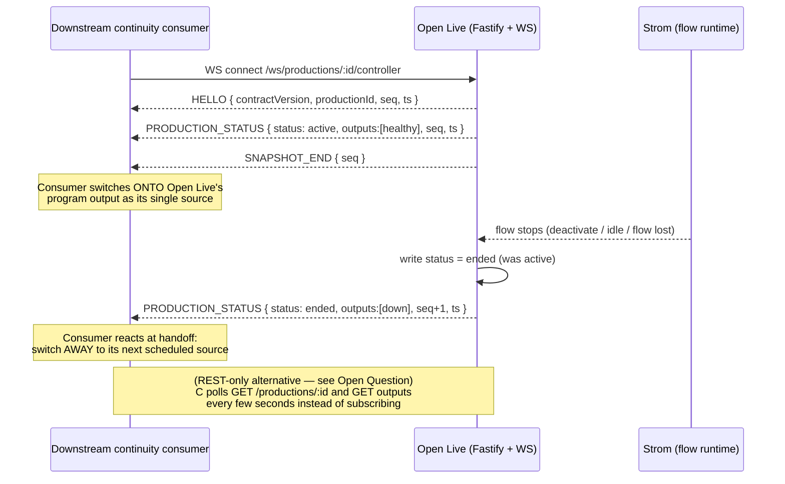

# Spec: Production output lifecycle + health status for single-source downstream consumers

**Status: Proposed** (architect draft for issue #255)
**Author:** architect agent
**Related issues:** #255 (this feature); reuses the merged control contract from #209
(`docs/specs/automation-control-contract.md`, PR #221)

> Proposed spec, not an accepted decision. The changes are deliberately additive and narrow.
> One genuine product trade-off (ship the WS lifecycle event vs. scope to REST-only polling)
> is left as an Open Question for @svensson00 — it is **not** pre-decided here.

## Problem Statement

Open Live can act as an upstream **single source** for a downstream channel-continuity consumer
(the proposed Open Playout component, an emergency-broadcast fallback, or any third-party playout
product) that treats Open Live's program output as one input in its own schedule and coordinates
only at handoffs — it never commands Open Live's mixer (that command surface belongs to the #209
automation contract, out of scope here).

That handoff primitive does not fully exist today. Reading the current code:

- `ProductionStatus` is `'active' | 'inactive' | 'activating'` (`src/db/types.ts:127`,
  `docs/openapi.yaml:43-45`). There is **no distinct "ended" state**, so a consumer cannot tell
  "never started" from "finished a broadcast" — both read `inactive`.
- The `Output` schema (`docs/openapi.yaml:169-186`) and `OutputDoc` carry **no status/health
  field**. A consumer polling "is the stream actually flowing?" has nothing to read.
- The merged #209 contract defines a rich in-production event vocabulary for automation clients
  driving the mixer (`TALLY`, `PIP_STATE`, `CLIP_STATE`, `HELLO`/`SNAPSHOT_END`) but **no
  production-level lifecycle event** a non-controlling, single-source consumer could subscribe to.

The result is that a continuity consumer is reduced to polling a status field that cannot
distinguish "healthy," "ended," and "broken" — undercutting the "one source, status/lifecycle
coordination only" architecture this line of work is built on.

## Goals / Non-goals

**Goals (this spec):**
1. Add an `ended` `ProductionStatus` value distinct from `inactive`, with a defined transition rule.
2. Add an `Output`-level health/status field surfaced via REST.
3. Add a production-level lifecycle WS event (`PRODUCTION_STATUS`) reusing #209's envelope
   — *gated behind the Open Question below.*

**Non-goals (out of scope, enforced as guardrails — see Risks):**
- Any command surface letting an external system start/stop/switch Open Live's mixer. That
  violates the "never commands the mixer" framing and belongs to #209's automation surface.
- The rundown/playlist/scheduling engine itself. That consumes this primitive but lives in the
  proposed Open Playout component, not here.

## API Design

All changes are additive. Existing clients and existing REST/WS payloads keep working unchanged.

### 1. New `ProductionStatus` value: `ended`

Extend the enum to `active | inactive | activating | ended` (`docs/openapi.yaml:43-45`,
`src/db/types.ts:127`).

**Semantics.** `ended` means "this production ran a broadcast and that broadcast has finished,"
as distinct from `inactive`, which means "not currently running (never started, or reset to a
clean idle state)."

**Transition rule (grounded in how status is actually set today).** Status is written in exactly
four places today:

| Site | Current write | Proposed write |
|---|---|---|
| Activation poll loop, flow reaches `playing` (`src/routes/productions.ts:330`) | `active` | unchanged |
| Explicit `POST /productions/:id/deactivate` (`src/routes/productions.ts:708`) | `inactive` | **`ended`** |
| Idle-watchdog auto-deactivate (`src/services/idle-watchdog.ts`, sets `autoDeactivated: true`) | `inactive` | **`ended`** |
| Activation failure / abort cleanup (`src/routes/productions.ts:371,507`) | `inactive` | unchanged (`inactive`) |
| Startup reconcile: live flow gone while doc was `active`/`activating` (`src/main.ts`) | `inactive` | **`ended`** |

Proposed rule, stated precisely:

- A production that was **`active`** (i.e. reached a live broadcast) and then stops — whether by
  explicit deactivate, idle-watchdog auto-deactivate, or reconcile discovering its Strom flow
  disappeared — transitions to **`ended`**. Both "explicit deactivate" and "abnormal termination"
  land on `ended`; the *reason* is disambiguated by existing fields already on the doc
  (`autoDeactivated: true` for the watchdog case; reconcile-driven resets can be marked similarly
  — see Data Model) rather than by a separate status value.
- A production that never reached `active` (activation failed or was aborted from `activating`)
  transitions to **`inactive`** — it never broadcast, so there is nothing to "end."
- Re-activating an `ended` production (`POST /productions/:id/activate`) moves it back through
  `activating` → `active` exactly as today; `ended` is not terminal.

This keeps `inactive` meaning "clean idle / never-ran-this-cycle" and gives consumers a reliable
"the broadcast you were following has finished" signal.

**REST surface change.** No new endpoints. The existing production GET/list and the `deactivate`
response (`src/routes/productions.ts:726`) simply return `status: "ended"` in the cases above.
No new error codes — the enum widening is backward-compatible for any client that treats unknown
statuses as "not active" (the forward-compat rule #209 already documents: ignore unknown values).

### 2. `Output`-level health/status field

Proposed additive field on the `Output` schema (`docs/openapi.yaml:169-186`) and `OutputDoc`:

```yaml
status:
  type: string
  enum: [healthy, degraded, down, unknown]
  # optional; omitted/absent is equivalent to "unknown"
```

**Verification of the health signal source — the honest finding.** I read the Strom client
(`src/lib/strom.ts`) and the flow generator (`src/lib/flow-generator.ts`) to confirm what health
signal actually exists per output today. Findings:

- Outputs are **not** independent objects in Strom. Each Open Live output becomes a *block* inside
  a single per-production Strom flow: `builtin.whep_output`, `builtin.mpegtssrt_output`, or
  `builtin.efpsrt_output` (`src/lib/flow-generator.ts:228-229,742-773`).
- The Strom `Flow` type exposes only a **flow-level** `running?: boolean` and a `FlowState`
  (`idle | playing | paused`, `src/lib/strom.ts:126`). `FlowState` is polled **only during
  activation** (`src/routes/productions.ts:214-353`); it is not tracked per output and not a
  per-output health signal.
- `FlowStatsResponse.stats` is `Record<string, unknown>` (`src/lib/strom.ts:467`) — unstructured;
  no documented per-output health field. `whepStreams()` lists WHEP endpoints
  (`src/lib/strom.ts:645`) but returns only `{ endpoint_id, mode, has_audio, has_video }` — no
  health/liveness. `MeterData`/`LoudnessData` flow events (`src/lib/strom.ts:650-660`) are audio
  metering, not output health.

**Conclusion: a per-output `healthy | degraded | down` signal is NOT cleanly derivable from what
Strom exposes today.** The only signal available now is coarse and flow-level (`running` /
`FlowState === 'playing'`), which would let us populate at most:

- `healthy` — production `active` and its flow `running === true` (all outputs of a running,
  playing flow, uniformly).
- `down` — production not `active`, or flow not running.
- `unknown` — Strom unreachable, or field absent on legacy docs.

There is **no code-verified source for a per-output `degraded` distinction** (e.g. one SRT output
dropping while WHEP is fine). Rather than invent a source, this spec ships the enum shape
(future-proofed to include `degraded`) but derives only `healthy | down | unknown` from the
flow-level signal in the first pass, and marks the per-output `degraded` derivation an **Open
Question** (below) pending either a Strom API addition or a decision to compute it from
`whepStreams()`/`stats` shape once those are confirmed to carry liveness.

**REST surface change.** `status` appears on `Output` in existing GET/list responses. Additive,
optional; no new endpoints or error codes.

### 3. Production-level lifecycle WS event: `PRODUCTION_STATUS`

*Gated behind the Open Question — implement only if the WS event is chosen over REST-only polling.*

Reuse #209's established broadcast envelope. Every outbound event is already stamped with
`ts` centrally in `broadcast()` (`src/services/tally.service.ts`), and #209's merged spec adds a
per-production monotonic `seq` at that same layer. The new event rides that machinery:

```jsonc
{
  "type": "PRODUCTION_STATUS",
  "seq": 42,                 // per-production monotonic int (#209 envelope)
  "ts": "2026-09-15T18:30:00.000Z",
  "productionId": "prod-abc",
  "status": "ended",         // ProductionStatus: active | inactive | activating | ended
  "outputs": [               // current per-output health snapshot
    { "id": "out-1", "status": "healthy" },
    { "id": "out-2", "status": "down" }
  ]
}
```

Emitted whenever `ProductionStatus` changes (the four transition sites above) and whenever an
output's derived `status` changes. Broadcast to the existing per-production subscriber set via
`broadcast(productionId, {...})` — the same fan-out `TALLY`/`PIP_STATE`/`PRODUCTION_DEACTIVATED`
already use (`src/ws/controller.ts`). A `PRODUCTION_DEACTIVATED` event already exists on deactivate
(`src/routes/productions.ts:699`); `PRODUCTION_STATUS` generalises it into a typed status carrier
rather than replacing it (kept additive; existing clients keep receiving `PRODUCTION_DEACTIVATED`).

**Connect snapshot.** Following #209's `HELLO` … `SNAPSHOT_END` pattern
(`docs/specs/automation-control-contract.md`), the WS connect sequence
(`src/ws/controller.ts:1583` onward) emits one `PRODUCTION_STATUS` with the current status +
output health as part of the snapshot, so a client attaching mid-broadcast learns the state
immediately without a REST round-trip, then resumes applying live events with `seq >
snapshotEnd.seq`.

> Note: the code today already stamps `ts` in `broadcast()` but has **not yet** landed #209's
> `seq` / `HELLO` / `SNAPSHOT_END` (those are #209's *proposed* additions). This event depends on
> that envelope work; if #209's envelope has not shipped when this is implemented, `PRODUCTION_STATUS`
> carries `ts` (present today) and `seq` is added together with the #209 envelope rollout.

## Data Model

CouchDB docs via `nano`. Two doc types change, both additively.

**`ProductionDoc`** (`src/db/types.ts`):
- `status: ProductionStatus` widens to include `'ended'`. No new required field.
- To disambiguate abnormal termination from explicit deactivate for the reconcile case, reuse the
  existing `autoDeactivated?: boolean` pattern; optionally add `endedReason?: 'deactivated' |
  'idle' | 'flow-lost'` (optional, defaulted-absent) if maintainers want a machine-readable reason
  on the doc. Marked minor; not required for the status transition itself.

**`OutputDoc`**:
- Add optional `status?: 'healthy' | 'degraded' | 'down' | 'unknown'`. Output health is derived
  from live flow state (see API §2), so this may be computed on read rather than persisted; if
  persisted, it is written on status-change only.

**Migration / back-compat.** No migration required. Existing docs lacking `status` on outputs
read as `unknown` (the enum's absent-value semantics). Existing productions with `status:
'inactive'` remain valid and unchanged — no doc is retroactively rewritten to `ended`; only new
transitions produce `ended`. A production that was `inactive` before this ships stays `inactive`
until its next active→stop cycle. All existing indexes/selectors
(`{ type: 'production', status: { $in: ['active','activating'] } }`,
`src/services/idle-watchdog.ts:67`) keep working because `ended` is simply not in that set.

## Service Interactions



## Configuration

No new environment variables or configuration keys are required. The transition sites, the
health derivation, and the WS event all reuse existing config (`config.stromUrl`,
`config.stromToken`) and the existing broadcast layer. **None.**

## Open Questions

**OQ-1 (product trade-off — for @svensson00 to decide).** Ship the WS lifecycle event (scope
item 3, `PRODUCTION_STATUS`) or scope this to **REST-only polling** of `Production.status` /
`Output.status` (items 1 + 2 only)?

- *For REST-only:* the issue's own disconfirming-evidence section argues a channel-continuity
  consumer tolerates seconds of latency (unlike #209's sub-second automation control plane), so
  polling `Production.status`/`Output.status` every few seconds once items 1+2 land may be
  sufficient, and a dedicated WS event is avoidable complexity. The issue pre-registers a kill
  condition: "wrong if birme scopes this down to REST-only (drops item 3) by 2026-10-15."
- *For the WS event:* push delivery removes handoff latency and polling load, and the envelope
  machinery (`broadcast`, #209's `seq`/`HELLO`/`SNAPSHOT_END`) already exists, making item 3
  cheap to add on top of items 1+2.

This decision is **assigned to @svensson00** and is deliberately not pre-decided in this spec.
Items 1 and 2 are recommended regardless of the outcome; item 3 is gated on this answer.

**OQ-2 (health-signal source — could not fully verify in code).** As documented in API §2, Strom
exposes no code-verified **per-output** health signal today — only a coarse flow-level
`running`/`FlowState`. The first pass can therefore derive only `healthy | down | unknown`. The
`degraded` value (e.g. one output failing while others are fine) has **no verified source** and
requires either (a) a Strom API addition exposing per-output/per-block liveness, or (b)
confirmation that `whepStreams()`/`FlowStatsResponse.stats` carry usable liveness we can compute
from. Needs a maintainer/Strom-owner answer before `degraded` can be populated truthfully.

## Risks

- **Back-compat.** The enum widening and the new optional `Output.status` field are additive.
  The main risk is a consumer that hard-fails on an unknown `status` value; mitigated by #209's
  documented forward-compat rule (clients must ignore unknown enum values / fields). Existing
  idle-watchdog and reconcile selectors are unaffected because they enumerate specific statuses,
  not "not ended."
- **Semantic drift on `ended` vs `inactive`.** If future code paths write `ended` where a
  production never actually broadcast, the distinction the issue asked for erodes. Mitigation:
  the transition rule is explicit that only an `active`→stop path yields `ended`; failed/aborted
  activations stay `inactive`.
- **Over-claiming output health.** Because per-output health is not truthfully derivable today
  (OQ-2), populating `degraded` prematurely would report health Open Live cannot actually observe.
  Mitigation: ship only `healthy | down | unknown` until OQ-2 is resolved.
- **Out-of-scope guardrails (from the issue).** This spec MUST NOT introduce any external
  mixer-command surface (that is #209's automation contract), and MUST NOT introduce a
  rundown/playlist/scheduling engine (that belongs to the proposed Open Playout component). Both
  are explicitly out of scope; any implementation PR that adds a command endpoint or scheduling
  logic under cover of this feature should be rejected in review.
