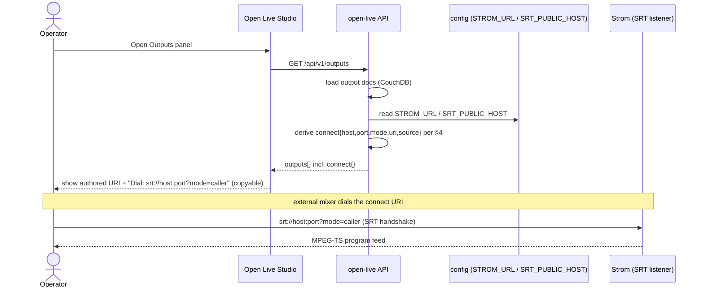

# Spec: Surface the connectable SRT output address to operators

- Issue: [Eyevinn/open-live#176](https://github.com/Eyevinn/open-live/issues/176) — "SRT output listen address is not surfaced anywhere the operator can read it"
- Status: Draft (architect, Phase 1 — pre-implementation)
- Repos affected: `Eyevinn/open-live` (backend), `Eyevinn/open-live-studio` (controller UI)
- Type: surfacing gap (no new subsystem)

---

## 1. Problem Statement

When an operator creates an output of type `mpegtssrt` or `efpsrt`, the SRT URI is
**authored by the operator** and stored verbatim on the output document, then passed
straight through to Strom as the `srt_uri` property of a `builtin.mpegtssrt_output`
block.

Evidence:
- `mpegtssrt`/`efpsrt` are two of three `OutputType`s (`src/db/types.ts:60`), and the
  output record stores a free-text `url` (`src/db/types.ts:62-71`, comment: *"SRT URI
  for mpegtssrt/efpsrt; undefined for whep"*).
- On activation the value is passed unchanged to Strom:
  `properties: { srt_uri: outputDoc.url }` (`src/lib/flow-generator.ts:776-786`). If
  `outputDoc.url` is empty the block is skipped entirely
  (`src/lib/flow-generator.ts:775`).
- The Studio "New Output" form pre-fills the **hostless listener form**
  `srt://:43524?mode=listener` (`OutputsPanel.tsx:50,55,201,219`), and the output list
  simply echoes `o.url` back (`OutputsPanel.tsx:131-133`).

So in the common case the stored/displayed value is `srt://:43524?mode=listener`: it has
a **port but no host**. Strom (the pipeline engine) binds that port and listens; the
external mixer must *dial into* the Strom host to pull the program feed. Nothing in Open
Live or Studio tells the operator what that host is. This blocks the documented
"Open Live output -> external mixer for local recording/mastering" workflow because the
operator has the port but no address to type into their SRT caller.

The listener form is not just a default — it is explicitly a first-class supported shape:
`srtUrl()` allows `srt://:PORT` "binds all interfaces" (`src/lib/url-validation.ts:151-193`),
and the Strom block reference documents `srt://:6000?mode=listener` as the canonical
output example (`docs/strom-block-config.md:69`).

**The hard part is not adding a field — it is that the connectable host is a property of
where Strom runs, and that varies by deployment topology (see §4).**

---

## 2. API Design

### 2.1 What exists today

`GET /api/v1/outputs` (`src/routes/outputs.ts:36-46`) returns each output through
`toApi()` (`src/routes/outputs.ts:30-33`), which strips `_id/_rev/type` and renames
`_id` → `id`. Current response for an SRT output:

```jsonc
// GET /api/v1/outputs  (current)
[
  {
    "id": "output-3f1c…",
    "name": "Program SRT",
    "outputType": "mpegtssrt",
    "url": "srt://:43524?mode=listener",
    "createdAt": "2026-09-04T10:00:00.000Z",
    "updatedAt": "2026-09-04T10:00:00.000Z"
  }
]
```

`url` here is the *operator-authored listen URI* — usually hostless. There is no field
telling the caller how to reach it. Schema: `Output` in `docs/openapi.yaml:169-186`
(`url: { type: string }`, optional).

### 2.2 Proposed change

Add a **read-only, derived** field `connect` to the `Output` API shape, populated
only for SRT-type outputs. Do NOT overload the existing `url` field — `url` remains the
operator-authored listen/bind URI (it is round-tripped by `PATCH` and by the Studio edit
form, and changing its meaning would break that). `connect` carries the *dial-in* address
an external caller should use.

Because the host cannot always be determined (see §4), the field is nullable and paired
with a machine-readable reason. Proposed shape:

```jsonc
// GET /api/v1/outputs  (proposed)
[
  {
    "id": "output-3f1c…",
    "name": "Program SRT",
    "outputType": "mpegtssrt",
    "url": "srt://:43524?mode=listener",   // unchanged: operator-authored bind URI
    "connect": {
      "uri": "srt://gpu-fra-1.osaas.io:43524?mode=caller",
      "host": "gpu-fra-1.osaas.io",
      "port": 43524,
      "mode": "caller",                    // the mode the EXTERNAL side should use
      "source": "strom-host"               // provenance — see enum below
    },
    "createdAt": "2026-09-04T10:00:00.000Z",
    "updatedAt": "2026-09-04T10:00:00.000Z"
  }
]
```

When the host cannot be resolved server-side, return an explicit null plus a reason
rather than guessing:

```jsonc
"connect": {
  "uri": null,
  "host": null,
  "port": 43524,
  "mode": "caller",
  "source": "unknown",
  "reason": "srt-host-not-configured"
}
```

Field semantics (all values must be *derived at read time* — see §3):

| Field | Notes |
|---|---|
| `connect.port` | Parsed from the authored `url`'s authority (reuse the parse in `srtUrl()`, `src/lib/url-validation.ts:179-188`). Always present for a well-formed SRT `url`. |
| `connect.host` | Resolved Strom SRT host (see §4). `null` if unresolvable. |
| `connect.mode` | The mode the **external caller** uses. If the authored `url` is `mode=listener` (Strom listens), the external side is `caller` → emit `"caller"`. If the authored `url` already specifies a host + `mode=caller` (Strom dials out to a remote listener), the external "connect" concept is inverted — see edge cases. |
| `connect.uri` | Fully-assembled `srt://host:port?mode=…` convenience string, or `null` when `host` is `null`. |
| `connect.source` | Provenance enum (see §4.5): `strom-host` \| `srt-public-host` \| `authored-host` \| `unknown`. |
| `connect.reason` | Present only when `uri` is `null`; documented enum: `srt-host-not-configured`, `srt-host-not-loopback-reachable`, `strom-url-not-parseable`, `non-srt-output`. |

**When populated:**
- Present with a non-null `port` for every `mpegtssrt`/`efpsrt` output that has a
  well-formed `url` containing a port.
- Omit the `connect` object entirely for `whep` outputs (WHEP already exposes its URL via
  the production doc's `whepOutputUrls`, e.g. `src/routes/productions.ts:245`) and for SRT
  outputs whose `url` is unset/empty (those are inert — the block is skipped at activation,
  `src/lib/flow-generator.ts:775`).

**Edge / error cases:**
1. `url` unset → no `connect` object (output is not startable).
2. `url` present but `mode=caller` with a real remote host (Strom dials *out*): there is no
   "listen address" to surface — the operator already typed the destination. Set
   `connect.source = "authored-host"`, `connect.host`/`port`/`uri` echoing the authored
   destination, and `mode` = `"listener"` (the remote end is the listener). This keeps the
   field meaningful without inventing anything.
3. Strom host cannot be resolved (see §4) → `uri:null, host:null, reason:"…"`, `port`
   still populated so Studio can at least show the port and an explanatory tooltip.
4. `GET /api/v1/outputs/:id` (`src/routes/outputs.ts:64-71`) must apply the identical
   derivation for consistency.

This is additive and backward-compatible: existing `url` semantics are untouched.

---

## 3. Data Model

**Recommendation: derive at read time. Persist nothing new.**

Rationale:
- The authored bind URI is already persisted (`OutputDoc.url`, `src/db/types.ts:68`). The
  port is fully recoverable from it.
- The **host is not a property of the output** — it is a property of *where Strom runs*,
  which is deployment config (`STROM_URL`, `src/config.ts:23`) and can change independently
  of any output (redeploy, migration, DNS change). Persisting a resolved host onto the
  output doc would go stale and create a second source of truth.
- `GET /api/v1/outputs` is a list read with no auth-sensitive host lookups needed —
  derivation is a cheap synchronous string operation on already-loaded data plus one config
  read.

Consequence: no CouchDB migration, no change to `OutputDoc` (`src/db/types.ts:62-71`), no
change to `POST`/`PATCH` write paths. `connect` is computed inside `toApi()` (or a small
helper it calls) in `src/routes/outputs.ts`.

**Assumption to confirm:** the resolved host does not depend on *which production* the
output is currently assigned to. Given a single `STROM_URL` per Open Live instance
(`src/config.ts:23`), one instance == one Strom == one SRT host, so this holds. If a future
topology introduces per-production Strom instances, host resolution would need the active
production context — out of scope here, flagged in §7.

---

## 4. Host resolution across topologies — CENTRAL SECTION

The connectable host is "the network host on which Strom is listening for the SRT
connection". Open Live only ever references Strom through **one** value:

- `config.stromUrl` = `process.env['STROM_URL'] ?? 'http://localhost:7000'`
  (`src/config.ts:23`), an **HTTP base URL** to the Strom pipeline engine.
- Every Strom interaction uses it: `new StromClient({ baseUrl: config.stromUrl, … })`
  (`src/routes/productions.ts:106,285,446,489,613`), and all WHEP URLs are assembled as
  `${config.stromUrl}/whep/…` (`src/routes/productions.ts:201,245,252`).

Critically, `STROM_URL` is the host for Strom's **HTTP API**. The SRT listener is a
**separate raw transport port** on the Strom host. The *hostname* is (in every topology we
find evidence for) the same machine as the HTTP API; the *scheme and port* are not. So the
correct derivation is: **take the hostname of `STROM_URL`, discard its scheme and HTTP
port, and combine it with the SRT port from the output's `url`.**

Topologies with real evidence:

### 4.1 Local / self-hosted, co-located Strom
- Evidence: default `STROM_URL=http://localhost:7000` (`src/config.ts:23`),
  `.env.example` `STROM_URL=http://localhost:8080`, README "15 EUR/month (self-hosted
  Strom)" (`README.md:14`), README env table (`README.md:50`).
- Connectable host: the hostname component of `STROM_URL`. For `localhost`/`127.0.0.1`
  this is **not externally reachable** — an external mixer on another machine cannot dial
  `localhost`. `srtUrl()` even *rejects* loopback/private hosts for `url`
  (`src/lib/url-validation.ts:190-192`), so we must not emit a loopback `connect.uri` as if
  it were dialable.
- API behaviour: if the resolved host is loopback/private (reuse `isPrivateHost()`,
  `src/lib/url-validation.ts:28-54`), return `host` echoed but set
  `reason: "srt-host-not-loopback-reachable"` so Studio can warn "only reachable from this
  machine". Do not silently present it as a public address.

### 4.2 OSC-hosted shared GPU (managed)
- Evidence: README "69 EUR/month (shared GPU in Frankfurt)" (`README.md:14`); the managed
  offering at `openlive.apps.osaas.io` (`README.md:1,11`); `STROM_AUTH_MODE='osc'` default
  with PAT→SAT exchange via `token.svc.prod.osaas.io` (`src/config.ts:25-27`,
  `README.md:56-58`). Here `STROM_URL` points at an OSC-hosted Strom instance
  (e.g. `https://<instance>.<svc>.osaas.io`).
- Connectable host: the hostname of that `STROM_URL`, **assuming the OSC-hosted Strom
  instance exposes its SRT listener port on the same public hostname**. This is the
  central unverified assumption of the whole feature (see §4.5 and §7).
- API behaviour: emit `connect.host` = hostname of `STROM_URL`, `source: "strom-host"`.

### 4.3 Operator authored a full caller URI (Strom dials out)
- Evidence: `srtUrl()` accepts `srt://host:port?mode=caller` with a real public host
  (`src/lib/url-validation.ts:155,190-192`); the input-side example uses this shape
  (`docs/strom-block-config.md:56`).
- Connectable host: already in the authored `url` — nothing to resolve. This is the one
  case where the host *is* known unambiguously server-side. Set `source: "authored-host"`.

### 4.4 The genuinely ambiguous / undeterminable case
When `STROM_URL` is loopback/private (§4.1) OR when the SRT port is known to be published
on a *different* host/NAT than the HTTP API (we found **no config field** that expresses a
distinct SRT-facing host — there is no `STROM_SRT_HOST` or equivalent in `src/config.ts`),
the host **cannot be determined correctly server-side**. In that case the API MUST return
`connect.host = null`, `connect.uri = null`, `connect.port` populated, and a `reason`.
Returning a wrong guess (e.g. blindly reusing `req.hostname` of the API request, which is
the *Open Live* host, not the *Strom* host) would actively mislead operators and is
explicitly rejected.

### 4.5 Recommendation and the missing config knob
Because the SRT-facing host is conceptually independent of the HTTP API host, the clean fix
is to introduce an **optional** dedicated config value, defaulting to the `STROM_URL`
hostname:

```
SRT_PUBLIC_HOST   // optional; when set, used verbatim as connect.host for SRT outputs
```

Resolution order (server-side, at read time):
1. If the authored `url` has an explicit non-empty host → use it (`source: "authored-host"`).
2. Else if `SRT_PUBLIC_HOST` is set → use it (`source: "srt-public-host"`).
3. Else derive hostname from `STROM_URL` (`source: "strom-host"`), unless it is
   loopback/private → then `host:null` + reason.
4. If `STROM_URL` is unparseable → `host:null`, `reason: "strom-url-not-parseable"`.

This mirrors the existing `PUBLIC_BASE_URL` pattern already used to disambiguate the
externally-reachable Open Live host from request-derived values
(`src/config.ts:40-46`, `src/routes/productions.ts:559-570`) — the same class of problem,
same solution shape. `SRT_PUBLIC_HOST` is the explicit escape hatch that resolves the
ambiguity for shared-GPU/NATed deployments where step 3 is wrong.

**Assumption to confirm with team-lead / devops (§7):** that on OSC shared GPU, the SRT
listener port is reachable on the same public hostname as `STROM_URL`. If OSC exposes SRT
via a separate load-balancer/hostname, `SRT_PUBLIC_HOST` becomes *required* in that
topology, not optional.

---

## 5. Service Interactions



Note: the external mixer connects to **Strom directly** over SRT — it never touches the
Open Live API for the media path. Open Live's only job here is to *tell the operator the
address*.

---

## 6. Studio changes

File: `open-live-studio/src/pages/SetupPage/OutputsPanel.tsx` and the API/store types.

1. `src/lib/api.ts`: extend `ApiOutput` (`api.ts:76-80`) with the optional
   `connect?: { uri: string|null; host: string|null; port: number; mode: string;
   source: string; reason?: string }`. No new request bodies — read-only field.
   (`outputs.store.ts` re-exports `ApiOutput`, so no store change needed beyond the type.)
2. Output list row (`OutputsPanel.tsx:124-134`): keep showing the authored `o.url`, and
   below it, for SRT outputs, add a **"Dial-in" line** rendering `connect.uri` with a
   copy-to-clipboard affordance (this is the value the external mixer needs).
3. When `connect.uri` is `null`, render the port plus an inline warning derived from
   `connect.reason` (e.g. "SRT host not configured — set SRT_PUBLIC_HOST" for
   `srt-host-not-configured`; "Only reachable from the Strom host" for the
   loopback/private case). Do **not** show a fabricated host.
4. Leave the Add/Edit modals unchanged — they author the *bind* URI (`url`); the dial-in
   URI is derived and read-only. Optionally update the help text near the SRT URI input
   (`OutputsPanel.tsx:214,219`) to clarify: "This is the address Strom binds. The address
   your external mixer dials is shown on the output after it's created."

---

## 7. Open Questions (need a human / team-lead / devops decision)

1. **OSC shared-GPU SRT reachability (blocking assumption).** Is the SRT listener port on
   an OSC-hosted Strom instance reachable on the *same* public hostname as `STROM_URL`
   (§4.2/§4.5)? If not, we need the exact hostname/port-mapping scheme OSC uses, and
   `SRT_PUBLIC_HOST` becomes mandatory for that topology. Requires devops confirmation.
2. **New config knob.** Approve adding `SRT_PUBLIC_HOST` to `src/config.ts` and the
   README env table (`README.md:44-52`)? (Recommended in §4.5.)
3. **Field naming.** `connect` object vs a flat `connectUri` string. This spec recommends
   the object because the port/host/reason are individually useful to Studio; confirm.
4. **Per-production Strom (future).** If Open Live ever runs a Strom per production/tenant,
   host resolution needs production context (§3). Out of scope now — confirm we can defer.
5. **Loopback presentation.** For local dev (`STROM_URL=localhost`), is a warning
   sufficient, or should we still emit the loopback host for same-host testing? (Spec:
   warn, don't present as dialable.)

---

## 8. Risks

- **Wrong-host risk (correctness/security).** Emitting a host that is not actually the SRT
  listener (e.g. reusing the Open Live API's own `req.hostname`) would send operators to
  the wrong machine. Mitigation: derive strictly from Strom config, and return `null` +
  reason rather than guessing (§4.4). Never use request-derived host for the SRT host.
- **Stale host if persisted.** Avoided by deriving at read time (§3).
- **Assumption drift.** If §7.1 turns out false, `connect.uri` would be confidently wrong
  on the flagship managed offering. Mitigation: ship `SRT_PUBLIC_HOST` override + the
  `source`/`reason` provenance so a wrong value is diagnosable and overridable without a
  code change.
- **Mode inversion confusion.** `mode=listener` on the authored URI means the *external*
  side is a caller; getting this backwards would show operators an un-connectable URI.
  Mitigation: explicit mode-flip logic in §2 with the `authored-host` caller case handled.
- **Low blast radius otherwise.** Purely additive read field; no write-path, DB, or
  activation changes, so it cannot affect running pipelines.

---

## 9. Implementation checklist (ordered, file-level)

**Backend (`Eyevinn/open-live`) — backend-developer:**
1. `src/config.ts`: add optional `srtPublicHost: process.env['SRT_PUBLIC_HOST'] ?? undefined`
   (after `publicBaseUrl`, ~line 46).
2. `src/lib/url-validation.ts` (or a new small `src/lib/srt-connect.ts`): add a helper
   `resolveSrtConnect(authoredUrl, { stromUrl, srtPublicHost })` implementing §2 + §4
   resolution order. Reuse the existing authority-parsing logic from `srtUrl()`
   (`url-validation.ts:179-188`) and `isPrivateHost()` (`url-validation.ts:28-54`).
3. `src/routes/outputs.ts`: in `toApi()` (line 30-33), when `outputType` is
   `mpegtssrt`/`efpsrt` and `url` is set, attach `connect` from the helper (pass
   `config.stromUrl`, `config.srtPublicHost`). Applies automatically to
   `GET /api/v1/outputs` (line 45), `GET /:id` (line 67), `POST` (line 61), `PATCH`
   (line 88) since all route through `toApi()`.
4. `docs/openapi.yaml`: extend the `Output` schema (lines 169-186) with the nullable
   `connect` object; document the `source`/`reason` enums. Do NOT add it to `OutputInput`
   (188) or `OutputPatch` (200) — it is read-only/derived.
5. `README.md`: add `SRT_PUBLIC_HOST` to the env table (44-52) with a note on the
   shared-GPU topology.
6. Tests: unit-test `resolveSrtConnect` across all §4 topologies (localhost → reason;
   authored caller host → authored-host; STROM_URL public host + listener url → strom-host;
   SRT_PUBLIC_HOST override; unparseable STROM_URL → reason).

**Frontend (`Eyevinn/open-live-studio`) — frontend-developer:**
7. `src/lib/api.ts`: add the optional `connect` field to `ApiOutput` (lines 76-80).
8. `src/pages/SetupPage/OutputsPanel.tsx`: render the dial-in URI with copy affordance and
   the `reason`-based warning in the output row (lines 124-134); update SRT URI helper text
   (lines 214-219).
9. Frontend test/visual check: SRT output with `connect.uri` shows a copyable dial-in
   line; with `connect.uri:null` shows the port + warning.

Once merged, this issue can move **Backlog → Ready** with items 1–9 as the hand-off scope.
