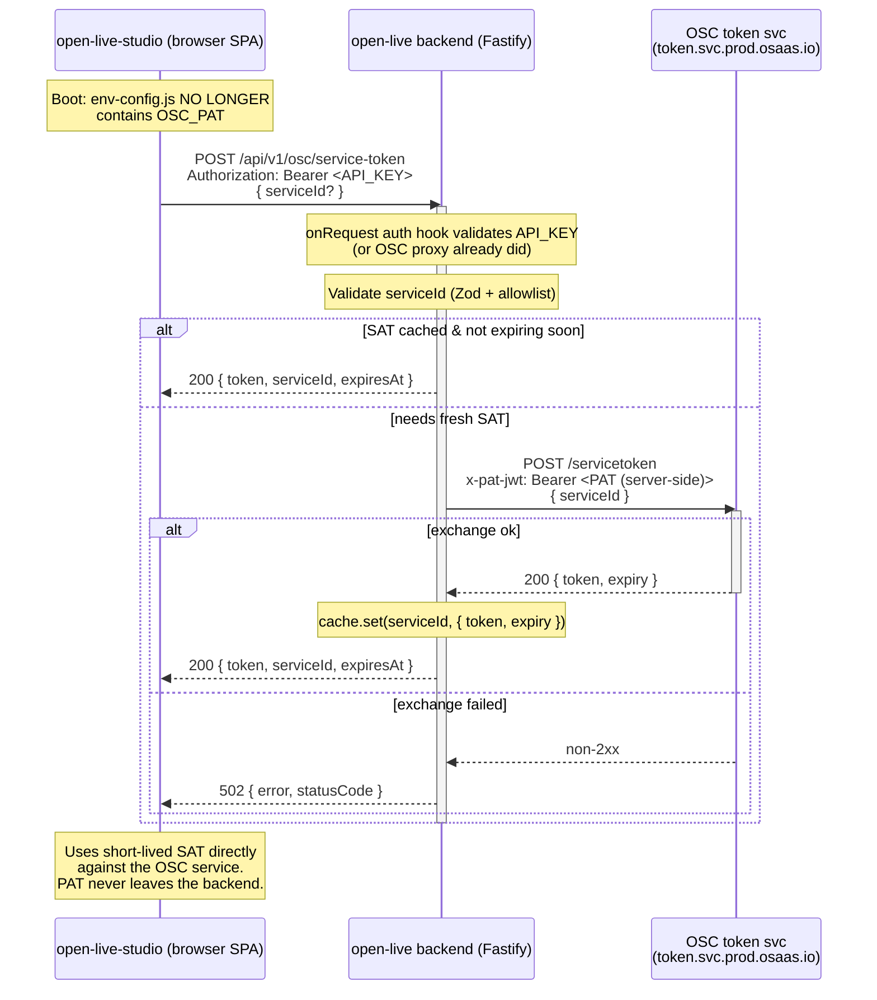

# Studio → Backend SAT Proxy

**Epic**: Cross-service remediation for `Eyevinn/open-live-studio` #10 — *[SECURITY][HIGH] OSC_PAT exposed in plaintext via publicly-accessible /env-config.js*
**Author**: architect
**Status**: Phase 1 — Spec (pending team-lead gate)
**Affected services**: `open-live` (backend), `open-live-studio` (frontend)

## 1. Problem Statement

The Open Live Studio frontend is a browser SPA. It currently receives an OSC **Personal Access Token (PAT)** — a long-lived, broadly-scoped credential — injected into its runtime environment via a generated `/env-config.js` file. Because `/env-config.js` is served as a static asset from the public web root, **anyone who can reach the studio can read the PAT in plaintext** (view-source, network tab, or a direct GET to `/env-config.js`). A leaked PAT grants an attacker the token holder's full OSC tenant privileges until the PAT is manually rotated.

The studio needs OSC-scoped access only to mint short-lived **Service Access Tokens (SATs)** for the OSC service(s) it talks to. A SAT is short-lived and single-service-scoped, so its exposure window and blast radius are dramatically smaller than a PAT's.

**Remediation (architectural, cross-service):** the studio must never hold the PAT. The **open-live backend** already holds an OSC PAT server-side (`STROM_AUTH_TOKEN`, consumed by `src/lib/strom-token.ts`) and already performs the OSC PAT→SAT exchange for its own Strom calls. We extend that capability with a **new authenticated backend endpoint** that performs the SAT exchange on the studio's behalf and returns **only** the short-lived SAT (plus expiry). The studio drops `OSC_PAT` from its build/runtime config entirely.

Non-goals: changing how the backend authenticates its own server-to-Strom traffic (that path in `strom-token.ts` already keeps the PAT server-side and is unaffected).

## 2. API Design

### New endpoint: `POST /api/v1/osc/service-token`

Mints a short-lived OSC SAT for a named OSC service and returns it to the caller. Modelled on the existing OSC exchange in `src/lib/strom-token.ts` (`POST https://token.svc.prod.osaas.io/servicetoken`, header `x-pat-jwt: Bearer <pat>`, body `{ serviceId }`, response `{ token, expiry }`).

Registered as a new Fastify plugin `src/routes/osc-token.ts`, following the `FastifyPluginAsync` + `/api/v1/...` conventions of the existing route files.

**Auth (critical — this is a privileged token-minting endpoint):**
This route is under `/api/v1`, so it is automatically covered by the existing `onRequest` auth hook in `src/server.ts` when `API_KEY` is set (`Authorization: Bearer <API_KEY>`). It **must not** be added to `AUTH_EXEMPT_PATHS`. On OSC-hosted deployments where `API_KEY` is unset (auth handled by the OSC reverse-proxy wall), the route inherits that same protection. The endpoint is a mint point for OSC credentials, so it must never be reachable unauthenticated — see Open Questions on the self-hosted-without-`API_KEY` case. It does not touch the DB, so it should be added to `DB_EXEMPT_PATHS` in `src/server.ts`.

**Request**

```
POST /api/v1/osc/service-token
Authorization: Bearer <API_KEY>        # when API_KEY is set (see auth note)
Content-Type: application/json
```

```jsonc
{
  // OSC service the SAT is scoped to. Optional — defaults to the
  // server-configured OSC_STUDIO_SERVICE_ID (see Configuration).
  // If provided, MUST be a member of the server-side allowlist (see section 6).
  "serviceId": "eyevinn-<service>"
}
```

Validated with Zod (the codebase already integrates Zod; `ZodError` yields a `400 { error: 'Validation error', issues, statusCode: 400 }` via the shared error handler in `src/server.ts`). `serviceId` constrained to `^[a-z0-9-]+$`, max length 128.

**Response `200`**

```jsonc
{
  "token": "<short-lived SAT JWT>",
  "serviceId": "eyevinn-<service>",
  "expiresAt": 1755859200          // unix SECONDS — pass-through of OSC `expiry`
}
```

Field naming note: OSC returns `expiry` in **seconds**. We surface it verbatim as `expiresAt` (seconds) to avoid the ms/seconds ambiguity that `strom-token.ts` handles internally (`data.expiry * 1000`). The studio-side field name (`expiresAt` vs `expiry`) is an integration detail not visible in this backend clone — see Open Questions.

**Error codes** (consistent with existing routes; shared error handler shapes the body as `{ error, statusCode }`):

| Status | Condition |
|--------|-----------|
| `400`  | Missing/invalid body — Zod validation error (bad `serviceId` format). |
| `401`  | Missing/incorrect API key (from the `src/server.ts` auth hook). |
| `403`  | `serviceId` not in the server-side allowlist. |
| `429`  | Rate limit exceeded — see rate-limit note below. |
| `502`  | OSC token service returned a non-2xx (SAT exchange failed). Internal detail is logged, not leaked (per the 5xx redaction in the error handler). |
| `503`  | Backend has no PAT configured (`STROM_AUTH_TOKEN`/OSC PAT unset) — endpoint cannot mint. |

**Rate limiting:** the global limiter (200/min/IP) applies. As a mint endpoint it should get a tighter per-route limit in the spirit of the WHIP/WHEP/activation routes (the code comments cite 10/min). Recommend `10/min/IP`; final value in Open Questions.

**Caching:** the backend should reuse the SAT-cache pattern from `strom-token.ts` (cache per `serviceId`, refresh 5 min before `expiry`) so repeated studio requests don't hammer the OSC token service. See Open Questions on whether the returned SAT should be a fresh mint per call or a shared cached token.

## 3. Data Model

**No persistent data-model changes.** No CouchDB documents are added or altered; the endpoint is stateless apart from an in-process SAT cache (a `Map<serviceId, { token, expiresAt }>`, mirroring the module-level `cache` in `src/lib/strom-token.ts`). This route must be added to `DB_EXEMPT_PATHS` so the DB-availability guard in `src/server.ts` does not 503 it.

## 4. Service Interactions



## 5. Configuration

**Backend (`open-live`)** — the PAT stays server-side only. Reuse the existing OSC PAT the backend already holds; add one config field for the studio's target service.

| Env var | Status | Purpose |
|---------|--------|---------|
| `STROM_AUTH_TOKEN` (legacy `STROM_TOKEN`) | existing | The OSC PAT, held server-side. Already consumed by `src/lib/strom-token.ts`. Reused as the credential for the new exchange. |
| `OSC_STUDIO_SERVICE_ID` | **new** | Default `serviceId` the studio SAT is minted for when the request omits it. |
| `OSC_STUDIO_SERVICE_ID_ALLOWLIST` | **new (recommended)** | Comma-separated allowlist of `serviceId`s the endpoint is permitted to mint SATs for. Prevents the endpoint from being abused to mint SATs for arbitrary services against the tenant's PAT. Defaults to just `OSC_STUDIO_SERVICE_ID`. |
| `API_KEY` | existing | Guards `/api/v1/*`, including this new route, on self-hosted deployments. |

Add `OSC_STUDIO_SERVICE_ID` (and allowlist) to `src/config.ts` and document in `.env.example`. The OSC token exchange URL is currently a hard-coded constant in `strom-token.ts` (`TOKEN_EXCHANGE_URL`); if the new route shares that helper it inherits the constant — no new URL config needed.

**Frontend (`open-live-studio`)** — the security fix:
- **Remove `OSC_PAT` from the studio's build/runtime env-config.js generation entirely.** It must no longer be templated into any browser-served asset.
- The studio calls `POST /api/v1/osc/service-token` on the open-live backend (base URL is the backend it already talks to) and consumes the returned short-lived SAT.
- Studio env-config.js retains only non-secret config (backend base URL, and — for self-hosted — how it authenticates to the backend; see Open Questions).

## 6. Open Questions (team-lead / cross-team)

1. **How does the studio authenticate TO this backend endpoint?**
   - *OSC-hosted*: the OSC reverse-proxy auth wall fronts the backend (`API_KEY` unset per config comments). Does the studio's browser request already carry the OSC session/proxy auth, or is a separate mechanism needed? Need OSC deployment topology confirmation.
   - *Self-hosted*: `API_KEY` is a single static bearer. If the studio is a public browser SPA, embedding `API_KEY` in `env-config.js` re-creates the same plaintext-exposure class of bug we are fixing (a static bearer in a public asset). **This is the crux open question** — options: (a) per-user/session auth in front of the studio, (b) a same-origin cookie/session between studio and backend, (c) accept that self-hosted `API_KEY` is lower-value than a tenant PAT. Needs a decision, possibly an ADR.

2. **SAT caching / TTL semantics.** Should the endpoint return a *shared cached* SAT (one token per `serviceId` reused across all studio clients until near-expiry, matching `strom-token.ts`) or mint a *fresh* SAT per request/per client? Shared-cache is simpler and lighter on the OSC token svc; per-client gives tighter revocation. Confirm the OSC SAT's actual TTL to size the refresh buffer (`strom-token.ts` assumes a 5-min buffer is meaningful).

3. **Interim mitigation — ship no-store headers now?** Should we, ahead of the full backend endpoint, ship a short-term mitigation on the studio side that sets `Cache-Control: no-store` on `/env-config.js` and/or moves it out of any CDN cache? This does **not** fix the exposure (the PAT is still readable by anyone who fetches the file) so it is at best a stop-gap that reduces incidental caching, not a real fix. Recommend rotating the exposed PAT immediately regardless. Team-lead to decide whether a stop-gap PR ships before the epic lands.

4. **Response field naming contract with the studio.** This backend clone doesn't include the studio consumer, so the exact expected field names/units (`expiresAt` seconds vs `expiry` ms, `token` key name) can't be verified here. Lock the contract with the frontend-developer before implementation to avoid a mismatch.

5. **Multiple OSC services?** Does the studio need SATs for more than one OSC service (hence the optional `serviceId` + allowlist design), or exactly one (in which case `serviceId` can be dropped from the request entirely and fixed server-side)? Confirm studio's OSC usage.

6. **Rate-limit value.** Confirm `10/min/IP` is appropriate given expected studio boot/refresh frequency across concurrent operators.

## 7. Risks

- **Open-redirect of privilege / SSRF-style abuse:** if `serviceId` is not allowlisted, an authenticated caller could mint SATs for any OSC service reachable by the tenant PAT. Mitigated by `OSC_STUDIO_SERVICE_ID_ALLOWLIST` (sections 2, 5) — treat the allowlist as required, not optional.
- **Self-hosted auth regression (see OQ1):** a naive implementation that ships `API_KEY` in the studio's `env-config.js` would reproduce the exact vulnerability being fixed. Must be resolved before the frontend side ships.
- **PAT still exposed until rotation:** the currently-leaked PAT remains valid until manually rotated. The code change does not invalidate the already-exposed credential — **rotate the PAT as an immediate operational step**, independent of this epic's merge timeline.
- **OSC token-service availability becomes a studio dependency:** the studio now depends on the backend + OSC token svc being reachable to obtain a SAT. Mitigated by the SAT cache (studio isn't blocked on every OSC round-trip) and the existing `502` handling pattern. A hard OSC outage means no new SATs — acceptable and matches the backend's own existing dependency on the same service.
- **Token leakage in logs:** the audit `onResponse` hook logs method/url/status/ip (not bodies), and the 5xx redaction in the error handler prevents SAT/PAT leakage in error responses. Implementation must ensure the SAT is never written to logs (avoid logging the response body of the OSC exchange; `strom-token.ts` only logs `res.status`/`statusText` on failure — follow that pattern).
- **Expiry skew:** returning `expiry` in seconds while `strom-token.ts` internally uses ms (`* 1000`) is an easy off-by-1000 bug for the studio. Nail the unit in the contract (OQ4) and document it inline.
