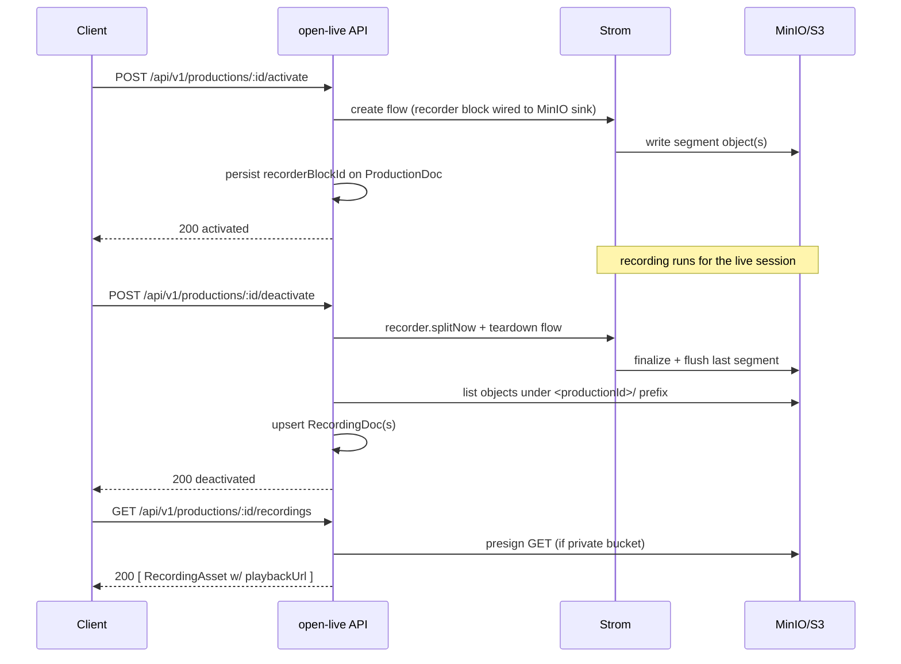

# Spec: VOD recording — wire Strom Recorder to MinIO for live-to-VOD archiving

**Status: Proposed** (architect draft for epic #5; covers sub-issues #41 and #42)
**Author:** architect agent
**Related issues:** #5 (epic), #41 (MinIO config + recorder wiring), #42 (VOD listing/playback endpoint)

> This is a proposed spec, not an accepted decision. Open Questions below must be
> resolved with a maintainer before implementation sub-issues (#41, #42) are picked up.

## Problem Statement

Open Live can ingest and mix live streams and egress them (SRT via `mpegtssrt`/`efpsrt`,
WebRTC via `whep`), but it cannot archive a production to durable object storage and expose
the recording as a playable VOD afterwards. There is no integration between the Strom
Recorder and MinIO/S3 in `open-live` today.

Grounding in the current code:
- Strom already exposes a recorder control surface. The client wraps a single call:
  `recorder.splitNow(flowId, blockId)` → `POST /api/flows/:flowId/blocks/:blockId/recorder/split`
  (`src/lib/strom.ts:896-899`). There is no `builtin.recorder` block emitted by
  `src/lib/flow-generator.ts` today — output blocks emitted are `builtin.mpegtssrt_output`,
  `builtin.efpsrt_output`, and `builtin.whep_output` (`src/lib/flow-generator.ts:197,228-229`).
- Outputs are modelled as `OutputDoc` with `outputType: 'mpegtssrt' | 'efpsrt' | 'whep'`
  (`src/db/types.ts:60-72`) and validated by a zod enum (`src/routes/outputs.ts:13`).
- Production lifecycle: `POST /api/v1/productions/:id/activate` builds the flow and
  `POST /api/v1/productions/:id/deactivate` tears it down (`src/routes/productions.ts:502,592`).
  On activate the doc gets `stromFlowId`, `mixerBlockId`, `audioMixerBlockId`, etc.; these are
  cleared on deactivate (`src/db/types.ts:151,168-169`).

The epic is cross-service: it requires a Strom recorder-to-object-storage block plus new
`open-live` API surface and data model, so it needs a spec before implementation.

## Scope

- **#41**: add MinIO/S3 configuration to service config; emit + wire a recorder block into the
  flow on activate; start/stop recording tied to the production lifecycle.
- **#42**: expose a REST endpoint that lists recorded VOD assets for a production and returns
  playback-ready URLs.
- **Out of scope**: transcoding recordings to adaptive formats, retention/lifecycle policies
  beyond a simple prefix convention, and a Studio VOD browser UI (separate dependent ticket).

## API Design

All new routes follow the existing conventions: `/api/v1` prefix, zod-validated bodies,
`toApi()`-style id mapping (`_id` → `id`), `503 { error: 'Database unavailable' }` on DB
failure, and auth via the existing `API_KEY` bearer gate in `src/server.ts`.

### Recording as an output type (#41)

Model recording as a new output type rather than a bespoke resource, to reuse the existing
output-assignment machinery (`ProductionOutputAssignment`, `POST /api/v1/productions/:id/outputs`).

Add `'recording'` to `OutputType` and the zod enum:

```
OutputType = 'mpegtssrt' | 'efpsrt' | 'whep' | 'recording'
```

`OutputDoc` for a recording output carries no `url` (destination is derived from MinIO config +
production id). Assigning a `recording` output to a production causes the flow generator to emit
a recorder block on activate.

Recording control is lifecycle-driven (starts on activate, stops on deactivate). No new
start/stop endpoints are strictly required for v1; segment rollover reuses the existing
`recorder.splitNow` Strom call. (Open Question 3 asks whether explicit manual start/stop is wanted.)

### VOD listing + playback (#42)

```
GET /api/v1/productions/:id/recordings
  200 → [ { id, productionId, key, sizeBytes, durationMs?, startedAt, endedAt?, playbackUrl } ]
  404 → { error: 'Production not found' }
  503 → { error: 'Object storage unavailable' }

GET /api/v1/recordings                (optional: list across all productions)
  200 → [ RecordingAsset, ... ]

GET /api/v1/recordings/:id
  200 → RecordingAsset
  404 → { error: 'Recording not found' }
```

`playbackUrl` is either a presigned GET URL (when the bucket is private) or a public URL (when
the bucket is public) — see Open Question 2. Field naming mirrors existing docs: `id`,
`createdAt`/`updatedAt` ISO strings, camelCase.

### Error codes

| Code | Condition |
|------|-----------|
| 400  | invalid body (zod) |
| 401  | missing/invalid `API_KEY` bearer (when configured) |
| 404  | production or recording not found |
| 409  | recording output already assigned / active conflict |
| 503  | CouchDB or object storage unreachable |

## Data Model

New CouchDB doc type `recording`, stored in a dedicated DB (mirroring `getOutputsDb()` /
`getSourcesDb()` in `src/db/index.ts`), written when a recording segment finalizes:

```ts
export interface RecordingDoc {
  _id: string;            // "recording-<uuid>"
  _rev?: string;
  type: 'recording';
  productionId: string;   // references ProductionDoc._id
  outputId?: string;      // the 'recording' OutputDoc that produced it
  bucket: string;
  key: string;            // object key, e.g. "<productionId>/<flowId>/<segment>.mp4"
  sizeBytes?: number;
  durationMs?: number;
  startedAt: string;      // ISO 8601
  endedAt?: string;       // ISO 8601, set when finalized
  createdAt: string;
  updatedAt: string;
}
```

`ProductionDoc` gains one optional lifecycle field, matching the existing pattern of
activate-set/deactivate-cleared ids (`stromFlowId`, `mixerBlockId`, …):

```ts
/** ID of the builtin recorder block — set on activate, cleared on deactivate */
recorderBlockId?: string;
```

### Migration

- New doc type and DB are additive; no rewrite of existing docs. CouchDB is schemaless so no
  ALTER-style migration is needed. The DB is created on first boot alongside the others in
  `src/db/index.ts`.
- Adding `'recording'` to the `OutputType` enum is backward compatible (existing outputs keep
  their values). The OpenAPI enum in `docs/openapi.yaml` must be extended in lockstep.

## Service Interactions



## Configuration (env vars)

Added to `src/config.ts` (same `process.env` + optional-fallback style used there today):

| Env var | Required | Default | Purpose |
|---------|----------|---------|---------|
| `MINIO_ENDPOINT` / `S3_ENDPOINT` | yes (to enable recording) | — | Object storage endpoint URL |
| `MINIO_ACCESS_KEY` | yes | — | Access key |
| `MINIO_SECRET_KEY` | yes | — | Secret key (never logged; add to `src/lib/log-redact.ts`) |
| `MINIO_BUCKET` | yes | — | Target bucket for recordings |
| `MINIO_REGION` | no | `us-east-1` | S3 region |
| `MINIO_USE_SSL` | no | `true` | TLS to endpoint |
| `RECORDING_KEY_PREFIX` | no | `""` | Optional prefix for all recording keys |
| `RECORDING_PRESIGN_TTL_S` | no | `3600` | Presigned playback URL TTL |

When the MinIO vars are unset, the `recording` output type is rejected at assignment time with
`400` (recording disabled) so the feature degrades cleanly, matching how the service already
tolerates optional config (`STROM_URL`, `API_KEY`, etc.).

## Open Questions (need a human/maintainer decision)

1. **Does Strom actually have an object-storage recorder sink today?** The `open-live` client
   only exposes `recorder.splitNow`; the flow-generator emits no recorder block. Confirm which
   Strom block writes to MinIO/S3 (its `block_definition_id`, properties, and whether it does
   the S3 write itself or writes local files that `open-live` must upload). This determines
   whether #41 is "wire an existing block" or "blocked on a Strom feature" (cf. the pattern in
   #171 where the Open Live change was blocked on `strom#694`).
2. **Bucket access model:** public bucket (public playback URLs) vs private bucket with
   `open-live`-issued presigned URLs. Presigned is the safer default; confirm.
3. **Manual vs automatic recording:** is lifecycle-tied auto-record (start on activate/stop on
   deactivate) sufficient for v1, or is explicit `POST .../recordings/start|stop` required?
4. **Segmentation & final container:** single object per session vs segmented (using
   `recorder.splitNow`), and the container/codec written (bearing on whether the VOD is directly
   web-playable — relates to the CMAF discussion in #171).
5. **Retention:** does `open-live` own lifecycle/expiry, or is that left to the bucket policy?

## Risks

- **Strom dependency risk:** if no object-storage recorder block exists, #41 is externally
  blocked; do not implement `open-live` glue until the Strom side is confirmed.
- **Credential leakage:** MinIO secret must be redacted in logs (`src/lib/log-redact.ts`) and
  never embedded in returned URLs beyond time-boxed presigned tokens.
- **Playback compatibility:** MPEG-TS/fMP4 written by Strom may not be directly browser-playable;
  a naive `playbackUrl` could 200 but fail in a `<video>` element. Tie the final-container
  decision (Open Question 4) to acceptance criteria.
- **Orphaned objects:** a crash between segment write and `RecordingDoc` upsert leaves objects
  unlisted. Mitigate by having the listing endpoint reconcile against the bucket prefix rather
  than trusting the DB alone.

## Sub-issue guidance

- **#41** implements config + recorder block wiring + `recorderBlockId` lifecycle. Blocked on
  Open Question 1.
- **#42** implements the listing/playback endpoints and `RecordingDoc`. Depends on #41.
